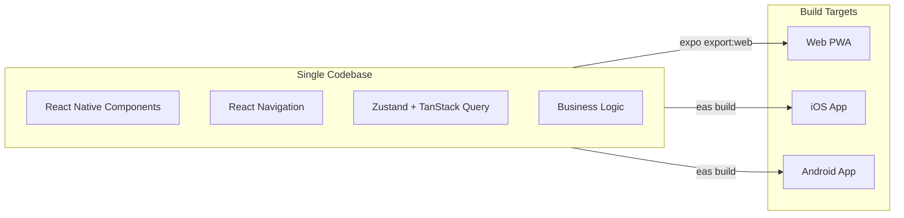

# Universal App (M6) - Architecture Documentation

## Overview

Единая кодовая база на Expo + React Native + React Native Web для iOS, Android и Web платформ с 95% переиспользованием кода.

## Architecture

### Tech Stack

- **Expo SDK 50+** - unified development platform
- **React Native 0.73+** - cross-platform UI framework
- **React Native Web** - renders RN components to DOM
- **React Navigation v6** - navigation (adaptive: Drawer/Tabs)
- **React Native UI Lib** - production-ready components
- **NativeWind 4.0** - Tailwind CSS for React Native
- **TanStack Query v5** - server state management
- **Zustand** - client state management
- **react-i18next** - internationalization

### Cross-Platform Strategy



### State Management Strategy

**TanStack Query** manages server state (80%):
- Stories (list, detail, status)
- Children profiles
- Characters
- Dictionaries (goals, tones, styles)
- User data

**Zustand** manages client state (20%):
- Authentication (token, user)
- Wizard form state
- UI state (modals, loading)
- Offline queue

### Responsive Design

**Breakpoints:**
- Mobile: < 768px (default)
- Tablet: >= 768px (`md:`)
- Desktop: >= 1024px (`lg:`)

**Navigation:**
- Desktop: Drawer Navigator (sidebar)
- Mobile/Tablet: Bottom Tab Navigator

**Layout:**
```tsx
// Example: responsive grid
<View className="
  grid grid-cols-1      // Mobile: 1 column
  md:grid-cols-2        // Tablet: 2 columns
  lg:grid-cols-3        // Desktop: 3 columns
  gap-4 p-4
">
```

### Authentication Flow

**Web:**
1. User clicks "Sign in with Google/Apple"
2. Redirect to backend OAuth start endpoint
3. Backend redirects to Google/Apple
4. After auth, callback to backend
5. Backend issues JWT token
6. Redirect back to app with token in URL
7. App saves token to AsyncStorage
8. Navigate to main app

**iOS/Android (with EAS Build):**
1. User clicks "Sign in with Google/Apple"
2. Native SDK opens OAuth flow
3. Get idToken from SDK
4. Send idToken to backend
5. Backend validates and issues JWT
6. App saves token to AsyncStorage
7. Navigate to main app

### API Integration

All API calls через `apiClient` (axios) с interceptors:
- Add auth token to headers
- Handle 401 (logout on expired token)
- Centralized error handling

Example:
```typescript
// Define query
export const useStories = () => {
  return useQuery({
    queryKey: ['stories'],
    queryFn: () => apiClient.get('/api/v1/stories').then(r => r.data.stories),
  });
};

// Use in component
const { data: stories, isLoading, error } = useStories();
```

### Internationalization

- Uses `packages/shared/i18n/{uk,ru,en,es}.json`
- Language detection: device locale or saved preference
- Language persistence: AsyncStorage
- Dynamic language switching
- All UI text localized

### Progressive Disclosure UX

Wizard follows "Quick start, easy extend" philosophy:

1. **Quick Start** (always visible): Theme, Tone, Language, Style
2. **Personalization** (expandable): Child profile, Characters
3. **Advanced** (expandable): Notes, custom settings

Benefits:
- New users: fast path (4 fields, 1 tap)
- Power users: full customization available
- Less overwhelming UI
- Better conversion rates

## Project Structure

```
apps/universal-app/
├── app.json                    # Expo configuration
├── package.json
├── tsconfig.json
├── babel.config.js             # Expo + NativeWind
├── tailwind.config.js          # NativeWind config
├── metro.config.js             # Monorepo support
├── index.js                    # Entry point
├── global.css                  # NativeWind styles
│
├── src/
│   ├── App.tsx                 # Root component
│   │
│   ├── config/
│   │   ├── constants.ts        # App constants
│   │   └── i18n.ts             # i18n setup
│   │
│   ├── navigation/
│   │   ├── RootNavigator.tsx   # Auth vs Main
│   │   ├── AuthNavigator.tsx   # Login screens
│   │   └── MainNavigator.tsx   # Tab/Drawer navigation
│   │
│   ├── screens/
│   │   ├── auth/
│   │   │   └── LoginScreen.tsx
│   │   ├── home/
│   │   │   └── HomeScreen.tsx
│   │   ├── wizard/
│   │   │   └── WizardScreen.tsx
│   │   └── library/
│   │       ├── LibraryScreen.tsx
│   │       └── StoryDetailScreen.tsx (TODO)
│   │
│   ├── components/             # Reusable components
│   │   ├── ui/                 # UI primitives
│   │   ├── wizard/             # Wizard components
│   │   ├── story/              # Story components
│   │   └── layout/             # Layout components
│   │
│   ├── hooks/
│   │   ├── useAuth.ts          # Auth hook
│   │   └── useResponsive.ts    # Responsive hook
│   │
│   ├── api/                    # TanStack Query
│   │   ├── client.ts           # Axios client
│   │   ├── auth.ts             # Auth API
│   │   ├── stories.ts          # Stories API
│   │   ├── children.ts         # Children API
│   │   └── dictionaries.ts     # Dictionaries API
│   │
│   ├── store/                  # Zustand
│   │   ├── authStore.ts        # Auth state
│   │   ├── wizardStore.ts      # Wizard state
│   │   ├── uiStore.ts          # UI state
│   │   └── offlineStore.ts     # Offline queue
│   │
│   ├── utils/
│   │   ├── storage.ts          # AsyncStorage wrapper
│   │   ├── oauth.ts            # OAuth helpers
│   │   └── responsive.ts       # Responsive utilities
│   │
│   └── types/
│       └── navigation.ts       # Navigation types
│
├── assets/
│   ├── images/                 # Images, icons
│   └── fonts/                  # Custom fonts
│
└── public/                     # Web-specific
    ├── index.html
    └── manifest.json           # PWA manifest
```

## Current Implementation Status

**Phase 1 (MVP):**
- ✅ Project structure and configuration
- ✅ Basic navigation (Auth + Main tabs)
- ✅ Authentication screens (placeholder)
- ✅ API client with interceptors
- ✅ Zustand stores (auth, wizard, UI, offline)
- ✅ TanStack Query hooks (stories, children, dictionaries)
- ✅ Responsive utilities
- ✅ i18n setup
- ⏳ Full screens implementation (wizard, library, etc.)
- ⏳ UI components library
- ⏳ Children/Characters management
- ⏳ Full OAuth implementation

**Next Steps:**
- Implement full wizard with progressive disclosure
- Children management screens (list, detail, forms)
- Characters management screens
- Enhanced library with search/filters
- Full OAuth integration (web + native)
- UI components library (wrapped RN UI Lib)

## Running the App

### Web Development
```bash
cd apps/universal-app
pnpm start
# Press 'w' for web
```

### iOS (Expo Go)
```bash
pnpm start
# Press 'i' for iOS simulator
# Or scan QR code with Expo Go
```

### Android (Expo Go)
```bash
pnpm start
# Press 'a' for Android emulator
# Or scan QR code with Expo Go
```

### Production Builds (Future - EAS Build)
```bash
# iOS
eas build --platform ios --profile production

# Android
eas build --platform android --profile production

# Web
expo export:web
# Deploy dist/ to Vercel/Netlify
```

## Deployment & Operations

### View Production Logs

```bash
# Quick logs view
./scripts/view-logs.sh

# Follow logs in real-time
./scripts/view-logs.sh -f

# Last 200 lines
./scripts/view-logs.sh -n 200

# Show only errors
./scripts/view-logs.sh -e
```

### Documentation

- **[Droplet Logs Guide](./docs/DROPLET_LOGS_GUIDE.md)** - Complete guide for viewing API logs
- **[Logs Cheat Sheet](./docs/LOGS_CHEATSHEET.md)** - Quick reference commands
- **[iOS Build Guide](./apps/universal-app/BUILD_IOS.md)** - Building for iPad/iPhone
- **[Environment Setup](./apps/universal-app/ENV_QUICK_REFERENCE.md)** - Production vs Local config

### Deployment Scripts

- `./scripts/deploy-api.sh` - Deploy API to production
- `./scripts/deploy-webapp.sh` - Deploy web app
- `./scripts/view-logs.sh` - View production logs

## Key Design Decisions

1. **Single Codebase:** 95% code reuse across platforms
2. **Progressive Disclosure:** Quick start with expandable advanced options
3. **Offline First:** AsyncStorage persistence + offline queue
4. **Type Safety:** Full TypeScript coverage
5. **Performance:** TanStack Query caching + Zustand minimal re-renders
6. **Accessibility:** Responsive design + i18n support
