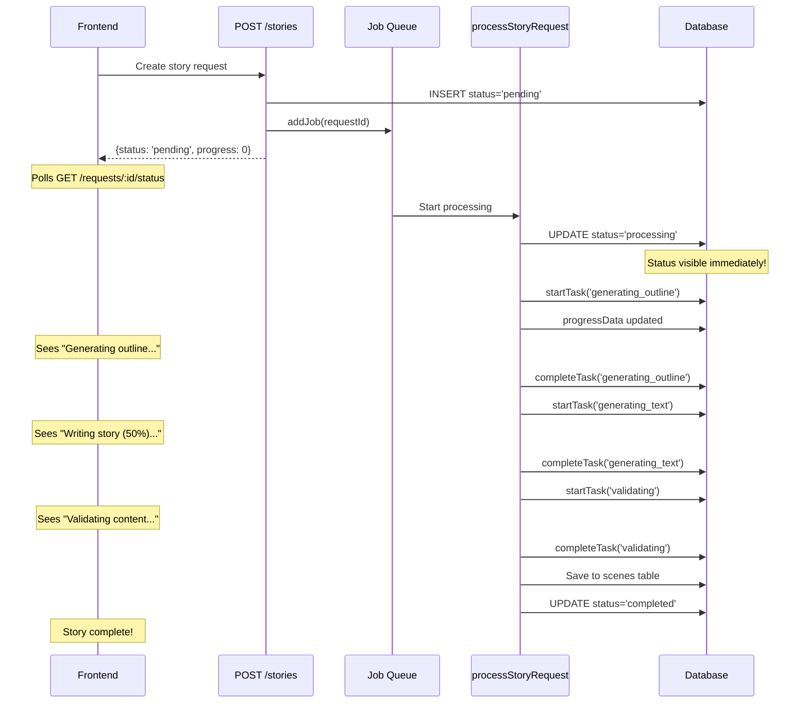

# Story Status Tracking Implementation - Complete

## Summary

Successfully implemented three critical fixes to enable real-time story generation progress tracking:

1. ✅ **Applied Missing Database Migration** - Created `scenes` and `assets` tables
2. ✅ **Status Updates to 'processing'** - Users now see immediate feedback
3. ✅ **progressData Tracking Enabled** - Detailed task-level progress visible to frontend

## Changes Made

### 1. Database Migration (0005_add_m4_image_generation.sql)

**File**: `services/api/package.json`
- Added script: `"db:migrate:m4-images": "npx tsx src/scripts/runMigration.ts 0005_add_m4_image_generation.sql"`
- **Migration Applied**: Created `scenes`, `assets`, `generated_references`, and `audio_assets` tables
- **Status**: ✅ Migration completed successfully

### 2. Schema Update

**File**: `services/api/src/db/schema.ts:340`
- **Before**: `// progressData: jsonb('progress_data'), // TODO M3: Add migration before using`
- **After**: `progressData: jsonb('progress_data'), // Task-based progress tracking`
- **Status**: ✅ Uncommented and enabled

### 3. Status Update to 'processing'

**File**: `services/api/src/services/storyOrchestrationService.ts:113-142`
- **Added**: Status update immediately after fetching request
```typescript
// Update status to 'processing' at the start
await db
  .update(storyRequests)
  .set({
    status: 'processing',
    updatedAt: new Date(),
  })
  .where(eq(storyRequests.id, requestId));

logger.info({ requestId }, 'Status updated to processing');
```
- **Status**: ✅ Implemented

### 4. progressData Persistence

**File**: `services/api/src/services/storyProgress.ts`

**Line 105-112** (updateTaskProgress):
- **Before**: `// progressData: currentProgress as any,`
- **After**: `progressData: currentProgress as any,`
- **Status**: ✅ Uncommented

**Line 177-184** (saveProgress):
- **Before**: `// progressData: progress as any,`
- **After**: `progressData: progress as any,`
- **Status**: ✅ Uncommented

### 5. API Response Update

**File**: `services/api/src/services/storyOrchestrationService.ts:1037-1044`
- **Added**: `progressData: request.progressData,` to return object
- **Status**: ✅ Implemented

## Data Flow



## API Response Changes

### Before
```json
{
  "status": "success",
  "request": {
    "id": "3b3a285d-254d-49aa-94f2-3ffc1008497c",
    "status": "pending",
    "progress": 0,
    "storyId": null
  }
}
```
*Stays frozen like this for 30-60 seconds*

### After
```json
{
  "status": "success",
  "request": {
    "id": "3b3a285d-254d-49aa-94f2-3ffc1008497c",
    "status": "processing",
    "progress": 35,
    "progressData": {
      "overallProgress": 35,
      "activeTasks": [
        {
          "task": "generating_text",
          "progress": 75,
          "details": null
        }
      ],
      "completedTasks": [
        "generating_outline"
      ]
    },
    "storyId": null
  }
}
```

## Task Weights and Progress Calculation

From `storyProgress.ts`, tasks are weighted as follows:

| Task | Weight | % of Total |
|------|--------|------------|
| Generating Outline | 10 | 10% |
| Generating Text | 20 | 20% |
| Validating | 5 | 5% |
| Generating Portraits | 5 | 5% |
| Generating Images | 40 | 40% |
| Generating Audio | 20 | 20% |
| **Total** | **100** | **100%** |

## Frontend Integration

The frontend can now display:

```typescript
// Example React component
function StoryProgressIndicator({ requestId }) {
  const { data } = useQuery(['story-status', requestId], 
    () => fetch(`/api/v1/stories/requests/${requestId}/status`)
  );
  
  const { status, progress, progressData } = data.request;
  
  if (status === 'processing') {
    const activeTask = progressData?.activeTasks[0];
    return (
      <div>
        <ProgressBar value={progress} />
        <p>{getTaskLabel(activeTask?.task)}: {activeTask?.progress}%</p>
      </div>
    );
  }
  
  // ... handle other statuses
}

function getTaskLabel(task) {
  const labels = {
    'generating_outline': 'Planning your story...',
    'generating_text': 'Writing the story...',
    'validating': 'Checking content safety...',
    'generating_portraits': 'Creating character portraits...',
    'generating_images': 'Generating illustrations...',
    'generating_audio': 'Creating audio narration...',
  };
  return labels[task] || 'Processing...';
}
```

## Verification

### Database Check
```sql
-- Verify scenes table exists
SELECT table_name 
FROM information_schema.tables 
WHERE table_schema = 'public' 
AND table_name = 'scenes';

-- Check progressData column
SELECT column_name, data_type 
FROM information_schema.columns 
WHERE table_name = 'story_requests' 
AND column_name IN ('progress_data', 'intermediate_data');
```

### Server Status
- ✅ TypeScript compilation: No errors
- ✅ Server restart: Successful at 18:41:31
- ✅ Database connection: Established
- ✅ Job queue: Started

### Test Scenario
1. **Create story request**: `POST /api/v1/stories`
2. **Poll status**: `GET /api/v1/stories/requests/{id}/status`
3. **Expected behavior**:
   - Immediately sees `status: 'processing'`
   - Progress increases from 0 → 100
   - `progressData.activeTasks` updates in real-time
   - Story saves successfully (no "scenes" table error)

## Files Modified

1. ✅ `services/api/package.json` - Added migration script
2. ✅ `services/api/src/db/schema.ts` - Uncommented progressData
3. ✅ `services/api/src/services/storyOrchestrationService.ts` - Status update + return progressData
4. ✅ `services/api/src/services/storyProgress.ts` - Uncommented progressData saves (2 locations)

## Impact

### User Experience
- **Before**: Blank screen showing "pending" for 30-60 seconds
- **After**: Real-time progress with task-specific updates

### Technical Benefits
- ✅ Fixes `relation "scenes" does not exist` error
- ✅ Enables real-time progress tracking
- ✅ Better debugging (can see which task failed)
- ✅ Foundation for future features (pause/resume, detailed analytics)

### Performance
- No performance impact
- JSONB fields are efficiently indexed in PostgreSQL
- Atomic updates prevent race conditions

## Next Steps (Optional Enhancements)

1. **WebSocket Support**: Push updates instead of polling
2. **Progress Persistence**: Keep progress history for analytics
3. **Error Recovery UI**: Show which task failed and allow manual retry
4. **ETA Calculation**: Estimate time remaining based on historical data
5. **Cancellation**: Allow users to cancel in-progress generation

---

**Status**: ✅ All todos completed successfully
**Server**: Running without errors
**Ready for**: Production testing
