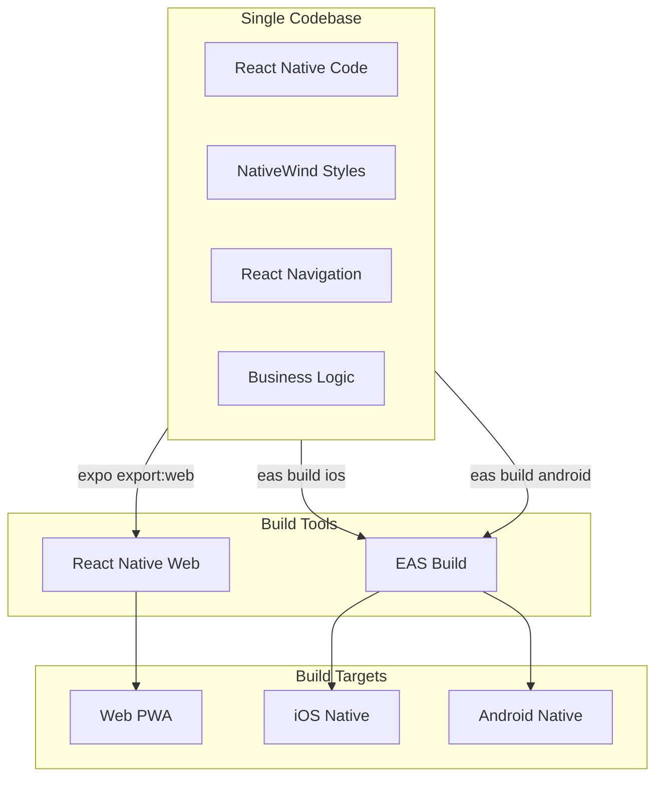
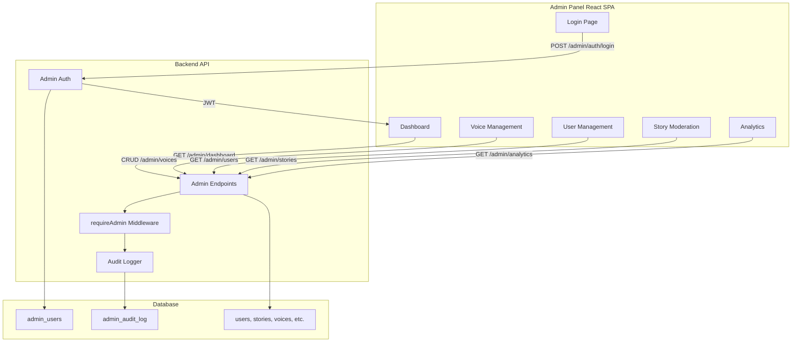

# Идея SaaS: «Казка+» — персонализированные иллюстрированные сказки на украинском (и русском) с педагогикой, возрастной адаптацией и премиум-озвучкой

## 1) Коротко о продукте (в 2 строках)
**«Казка+»** — приложение для родителей, которое за 30–60 секунд создаёт **безопасную, педагогичную, возрастно‑адаптированную** сказку на ночь с **многими иллюстрациями по ходу сюжета**, **персональными героями** (имя ребёнка, семья, любимая игрушка), подсказками поворотов сюжета и **озвучкой разными голосами** (премиум).

**Ключевая гипотеза:** родители готовы платить ~100 грн/мес, если продукт экономит время, снимает «я не знаю что придумать», даёт **готовый сценарий**, **красивые картинки** и **ритуал сна без конфликтов**.

---

## 2) Почему это «открытая» ниша (именно в Украине)
### Боль родителей
- Вечером нет времени и фантазии «выдумывать» — нужен **готовый сценарий**.
- Важно соответствие возрасту: **1 год** ≠ **8 лет** (словарь, длина, страхи, мораль, сложность).
- Родители хотят **пользу**: доброта, дружба, эмпатия, уважение к родителям, самостоятельность, безопасность.
- Родители хотят **украинский язык и культурный контекст**, но при этом — современную UX/качество.

### Сигналы рынка
- Мировые аналоги уже доказали спрос (BedtimeStory.ai, StoryWizard, Storytime AI и др.) — но локальная «украинская» версия с глубокой педагогикой и сценариями всё ещё выглядит незаполненной.
- В Украине и мире тренд на рост расходов на подписки в неигровых приложениях (пользователи тратят больше, хотя загрузки стагнируют) — подписка как модель зрелая.

---

## 3) Быстрый анализ украинского рынка (что важно учитывать)
### 3.1 Демография и спрос
- Рынок родителей существует даже при падении рождаемости: ключевое — высокая ценность **ежедневного ритуала** и **снижения стресса**.
- Для TAM/массовости критичны:
  - широкая доступность (Android + iOS),
  - простая подписка,
  - возможность делиться (Telegram/Viber),
  - семейные планы.

### 3.2 Привычка платить за подписки
- В Украине есть привычные «якоря» подписки около 100 грн/мес (например, массовые consumer‑подписки типа YouTube Premium и др.).

### 3.3 Конкурентная среда
- Есть украинские генераторы сказок, но обычно:
  - без полноценной персонализации картинок,
  - без «возрастного двигателя»,
  - без умного сценарного ассистента,
  - без сильной безопасности/педагогики,
  - без премиум‑озвучки с голосами.

---

## 4) Конкуренты и референсы (лучшее, что стоит забрать)

### 4.1 Глобальные продукты (референсы)
#### BedtimeStory.ai (референс по «персонализация + стиль + мораль + картинки»)
- Персонализация: ребёнок/семья как персонажи, жанр, арт‑стиль, мораль.
- Генерация нескольких изображений на историю.
- «Публикация»/шаринг.
- Подписка: около $8.25/мес при annual; лимиты историй/картинок.

#### StoryWizard.ai (референс по «книга как артефакт»)
- «Книга‑опыт»: превращение истории в книгу; сильная ориентация на детей/обучение.
- Модель pay‑per‑use: например, пакеты историй.

#### Storytime AI (референс по «озвучка + голоса + PDF/видео»)
- Премиум даёт: множественные голоса озвучки, конвертацию в видео, экспорт PDF/MOV.

#### Gemini Storybook (референс по «качество иллюстраций»)
- Сильный генератор иллюстрированных «storybook» (для вдохновения по качеству и консистентности).

### 4.2 Украинские / локальные продукты (как минимум для сравнения)
#### WonderTales.fun
- Плюсы: украинский язык, простой вход.
- Минусы (ваши наблюдения):
  - нет персонализированных картинок,
  - нет возрастного режима,
  - часто требует от родителя самому «придумать события».

#### «Світ Казок: Дитячі Історії» (app)
- Плюсы: украинский интерфейс, библиотека + AI‑создание, озвучка/офлайн.
- Минусы типично (по рынку подобных приложений):
  - слабее сценарный ассистент,
  - слабее «персонажная консистентность» картинок,
  - мало «guided storytelling» (подсказок поворотов).

---

## 5) Матрица фич: что есть у лучших и чего нет у большинства

### 5.1 «Must-have» (без этого продукт не ощущается как BedtimeStory‑класс)
1) **Возрастной двигатель**: 1+, 2–3, 4–5, 6–8, 9–12 (словарь, длина, страхи, мораль, сюжетные конфликты).
2) **Guided storytelling**: подсказки сценариев, поворотов, конфликтов, развязок.
3) **Многокадровые иллюстрации**: не одна обложка, а серия сцен.
4) **Персональные герои**: имя ребёнка, семья, любимая игрушка/питомец.
5) **Педагогическая направленность**: мораль/ценности, без морализаторства.
6) **Безопасность**: жёсткие правила, фильтры, возрастной контроль.
7) **Озвучка**: выбор голоса, темп, «спокойный режим сна».
8) **Шаринг**: ссылка, PDF, короткое видео‑резюме, отправка в Telegram.

### 5.2 «Вау-фичи» (делают продукт вирусным)
- **Сказка по рисунку/фото**: ребёнок рисует монстра/корабль → он становится героем истории.
- **Стикеры/эмодзи из героев** (мерч): авто‑пак стикеров для Telegram.
- **Коллекции**: «7 ночей про дружбу», «5 историй про смелость без страха», «младшие — спокойные истории».
- **Недельный сериал**: каждая ночь — новая серия с теми же героями.

### 5.3 Фичи, которых чаще всего не хватает конкурентам (ваш «gap list»)
- **Сценарные предложения вместо пустого поля** (родитель выбирает из 6–12 карточек).
- **Генерация «поворотов сюжета» в один тап** (вместо “придумайте события”).
- **Возрастная адаптация не только длины, но и тематики конфликтов** (для 1–3 — микро‑ситуации; для 8 — моральные дилеммы, дружба, ответственность).
- **Консистентные персонажи в иллюстрациях** (одинаковое лицо/одежда от сцены к сцене).
- **Безопасность на уровне системы (policy engine), а не “попросили в промпте”**.
- **Премиум‑озвучка + «режим сна» (таймер, затухание, белый шум)**.

---

## 6) Нормативы и «правила безопасных сказок» (Украина) — как встроить
> Ниже — практичная интерпретация норм под продукт. Это не юридическая консультация; перед запуском стоит сделать короткий legal review.

### 6.1 Возрастная категоризация (как стандарт продуктовой логики)
Есть украинские стандарты для детских изданий, где возраст делится на группы (например: до 5; 6–10; 11–14; 15–18). Это можно использовать как основу возрастного движка.
- Референс: стандарт для детских изданий (ДСТУ 29.6‑2002 / ГСТУ 29.6‑2002 в архиве стандартов).

### 6.2 Защита детей от вредного контента
В Украине действуют нормы о защите детей и ограничениях для вредного/аморального контента (в т.ч. «Про охорону дитинства», «Про захист суспільної моралі», нормы в «Про медіа» по защите детей и маркировке).

### 6.3 Практические правила контента (контент‑политика «Казка+»)
**Запрещено в детских сказках (особенно для 0–8):**
- графическое насилие, жестокость, пытки;
- сексуальный контент, романтика/эротика;
- саморазрушение/суицидальные темы;
- инструкции опасных действий;
- язык ненависти, дискриминация;
- токсичные паттерны (шантаж, манипуляции, унижение).

**Ограничено и зависит от возраста:**
- «страшное» (для 1–3 почти исключить; для 6–8 — мягкое напряжение без кошмаров; обязательно безопасная развязка);
- конфликты — только разрешаемые, без травматизации.

**Обязательно:**
- позитивная развязка, поддержка, ощущение безопасности;
- мораль, встроенная в сюжет (не «нравоучение»);
- уважение к семье/друзьям;
- инклюзивность (без стереотипов).

### 6.4 Приватность (детские данные)
- Минимизировать персональные данные: имя ребёнка можно хранить локально или шифровать.
- Фото/рисунки — чёткая политика: удаление по умолчанию, опциональное хранение, родительский контроль.

---

## 7) Продуктовая концепция «Казка+»: сценарии, которые снимают “нет фантазии”

### 7.1 Главный экран: «Сказка за 60 секунд»
Родителю не нужно писать промпт.

**Шаг 1 — Возраст:**
- 1 год, 2–3, 4–5, 6–8, 9–12

**Шаг 2 — Цель/смысл (педагогика):**
- доброта, дружба, эмпатия, уважение к родителям, помощь дома,
- самостоятельность, смелость без страха, «делиться», «не обижать»,
- безопасность (дорога/вода/незнакомцы) — осторожно, без запугивания.

**Шаг 3 — Настроение/жанр:**
- спокойная/медитативная
- приключение
- юмор
- сказка‑песня (колыбельная)
- «обучающая» (цифры/буквы/логика)

**Шаг 4 — Персонализация:**
- имя ребёнка
- герой‑питомец
- родители как персонажи

**Шаг 5 — Иллюстрации:**
- стиль (мягкая акварель / пиксар‑лайт / книжная графика)
- «одинаковые герои» (consistency)

**Кнопка:** «Создать»

### 7.2 Сценарные подсказки (самое важное отличие)
Вместо “какие события должны случиться”:
- 12 карточек «сценариев»:
  - «потерял любимую игрушку и нашёл с помощью друга»
  - «поссорился — научился извиняться»
  - «помог родителям — получил суперсилу доброты»
  - «страшно темноты — нашёл свет внутри»
  - «не хотел убирать — понял про порядок»

И «внутри истории» кнопки:
- **Добавить поворот:** «встреча с помощником», «неожиданная загадка», «проверка на доброту»
- **Сделать спокойнее** / **сделать веселее** / **ускорить к финалу**

### 7.3 Возрастной движок (пример правил)
**1 год (0–12 мес):** 200–400 слов, повторения, ритм, простые предметы, 0 конфликтов, 1 эмоция «спокойно».

**2–3 года:** 400–700 слов, 3–5 простых сцен, очень мягкий конфликт (потерял/расстроился), быстрый хэппи‑энд.

**4–5 лет:** 700–1200 слов, 6–8 сцен, простая мораль, диалог, мини‑выборы.

**6–8 лет:** 1200–2000 слов, 8–12 сцен, более сложные эмоции, дружба, ответственность, загадка.

**9–12 лет:** 2000–3500 слов, 12–18 сцен, моральная дилемма, развитие персонажа, юмор.

---

## 8) Иллюстрации: много сцен + консистентные герои + «по рисунку/фото»

### 8.1 Много иллюстраций по ходу сказки
- Генерируем **storyboard**: список сцен (8–12) и под каждую — иллюстрацию.
- В тексте отмечаем моменты для картинки (не каждые 2 предложения, а по сценам).

### 8.2 Консистентность персонажей
- При первом запуске персонажа создаём **Character Sheet**:
  - описание внешности, одежды, цвета,
  - 2–3 референс‑изображения,
  - запрет на «взросление/смену лица» от сцены к сцене.

### 8.3 Картинки по рисунку/фото
- Режим «Сказка из рисунка»:
  1) ребёнок рисует героя или предмет
  2) родитель фотографирует
  3) система извлекает сущности (кто/что) и предлагает 6 сценариев
  4) генерирует историю и иллюстрации с этим героем

**Важно:** строгая политика приватности: рисунки/фото удаляются автоматически (настраиваемо).

---

## 9) Озвучка и «ритуал сна» (премиум)

### 9.1 Озвучка
- Выбор голоса (мужской/женский, «мама‑стиль», «сказочник»).
- Скорость/паузы.
- Украинский TTS (качественные голоса — ключ к удержанию).

### 9.2 Режим сна
- Таймер
- Затухание громкости
- «Белый шум»/«дождь» (опционально)
- Авто‑переход к спокойным концовкам

---

## 10) Делится сказкой: как встроить «хайп» и вирусность

**Артефакты, которые хочется отправить друзьям:**
- «Обложка» (красивая карточка 9:16 под сторис)
- Ссылка на чтение (web‑viewer)
- PDF‑книга
- Короткое видео (листает страницы + озвучка 15–30 сек)
- Пак стикеров из персонажей (мерч‑фича)

**Виральная петля:**
- В конце истории: «Поделиться с другом» → отправляет обложку и ссылку.
- Друг открывает: читает 1 историю бесплатно → paywall на «озвучка/иллюстрации/серии».

---

## 11) Монетизация (цель: 100 грн/мес массово)

### 11.1 Бесплатный план (чтобы набрать аудиторию)
- 3 истории в неделю
- 3 картинки на историю
- 1 голос озвучки (низкое качество или короткие фрагменты)
- шаринг ссылки

### 11.2 Premium ~100 грн/мес
- 1–2 истории в день
- 8–12 иллюстраций (storyboard)
- 6–10 голосов
- режим сна
- серии (продолжения)
- «сказка по рисунку/фото» (лимит)
- экспорт PDF + видео

### 11.3 Family (например 149–179 грн/мес)
- до 4 детей
- профили/интересы/возраст
- библиотека «любимые сказки»

### 11.4 Апсейл: печать и мерч
- печать книги (hard/soft cover)
- печать стикеров
- подарочный набор (книга + стикеры + открытка)

---

## 12) Печать книги и доставка (фаза 2)

**MVP печати без сложной логистики:**
- Генерация PDF под типографский формат
- Партнёрство с 1–2 типографиями (Kyiv/Lviv) + Nova Poshta
- Заказ в 3 клика: формат, обложка, адрес

**Подарочные поводы:**
- день рождения
- начало школы
- «первый зуб/первое слово» (семейные milestones)

---

## 13) Технологическая схема (высокоуровнево)

### 13.1 Pipeline истории
1) **Age Engine** → правила длины/словаря/тем
2) **Plot Assistant** → сценарии/повороты (выбор карточками)
3) **Outline Generator** → сцены (storyboard)
4) **Story Writer** → финальный текст
5) **Safety Filter** → проверка/переписывание
6) **Illustration Prompter** → промпты под каждую сцену + консистентность
7) **Image Gen** → картинки
8) **TTS** → озвучка

### 13.2 Safety by design
- Система правил (policy engine) + автоматический «переписывающий модуль»
- Логи причин блокировки/переписывания
- Белые списки тем для малышей

---

## 14) Техническое задание: AI-пайплайны, контроль качества, серии, голоса и видео

### 14.1 Генерация изображений с консистентными персонажами
**Цель:** во всех иллюстрациях серии (и особенно в «сериале на 5–7 эпизодов») ребёнок/герои выглядят одинаково (лицо, волосы, одежда, стиль), при этом сцены меняются.

**Подход 1 — «Reference-based» (рекомендуемый для MVP):**
- Храним **Character Sheet** (структурированное описание + 2–5 референсов):
  - текст: внешность, одежда, ключевые признаки, палитра,
  - изображения: 2–5 «канонических» портретов (создаются один раз),
  - «запрещённые изменения»: возраст, пол, форма лица, цвет глаз, и т.д.
- Для генерации сцен используем комбинацию:
  - **IP-Adapter / image prompting** (вшиваем референс лица/героя),
  - **ControlNet** для контроля композиции (скетч/поза/глубина/границы персонажей),
  - фиксируем стиль (единый art-style prompt + негативные подсказки).

**Подход 2 — «Персональная LoRA/DreamBooth» (фаза 2, когда нужно «вау»):**
- Для ребёнка (или семейного набора персонажей) обучаем лёгкий адаптер (LoRA) под выбранную базовую модель (например, SDXL/SD3.x).
- Плюсы: выше консистентность в разных сценах и позах.
- Минусы: сложнее инфраструктура, требуется датасет фото и строгая приватность.

**Подход 3 — «Готовые персонажи (library)» (массовый бюджетный путь):**
- Вместо обучения на фото — каталог «типажей» (герой-мальчик/девочка/питомцы/родители) + минимальная персонализация (имя, цвет волос/одежды).
- Для большинства пользователей даёт ощущение персонализации без риска приватности.

**Требования к иллюстрациям:**
- 6–12 сцен на сказку (по возрасту), единый стиль в рамках истории.
- Автоматический «перегенерировать сцену» без пересоздания текста.
- Модуль «анти-артефакты»: проверка на странные лица/лишние пальцы/ошибки текста в картинке.

### 14.2 Генерация видео (фаза 2/3)
**Цель:** сделать из сказки «листабельное» видео (15–60 сек) для шаринга.

**MVP-видео без генеративного видео:**
- Берём сцены (иллюстрации) → делаем слайд-шоу
  - плавные панорамы/zoom (Ken Burns),
  - синхронизация с озвучкой,
  - субтитры (1–2 строки),
  - экспорт 9:16.

**Gen-video (фаза 2):**
- Image-to-video для отдельных сцен (2–4 секунды) с мягкой анимацией (движение персонажа/облака/фон).
- Важно: ген-видео дороже и менее предсказуемо → использовать точечно (обложка/1–2 ключевых момента).

### 14.3 Как описать «правила контента» для AI
Нужна **двухуровневая система**: (A) декларативные правила (конфиг), (B) исполнитель (policy engine).

**A) Контент-правила как конфиг (пример структуры):**
- age_group: 1y | 2-3 | 4-5 | 6-8 | 9-12
- allowed_themes: дружба, доброта, эмпатия, помощь, ответственность, безопасность…
- disallowed: насилие (графическое), унижение, сексуальный контент, самоповреждение, инструкция опасных действий, язык ненависти…
- fear_level_max: 0..3 (где 0 — полностью спокойная)
- moral_style: «показать через поступок», без нравоучения
- vocabulary_profile: простые слова/длина предложений/повторы
- scene_rules: max_scenes, min_scenes, max_characters_in_scene

**B) Policy engine (исполнитель):**
- Проверяет:
  1) входные пожелания пользователя,
  2) outline (сцены),
  3) финальный текст,
  4) alt-текст к иллюстрациям,
  5) текст для озвучки.
- Если нарушение:
  - автоматически переписывает фрагмент (repair),
  - либо предлагает безопасные альтернативы пользователю,
  - либо блокирует.

### 14.4 Как контролировать то, что возвращает AI (quality gate)
**Ключевая идея:** модель никогда не пишет «как хочет» — она заполняет **структурированный контракт**, а дальше проходит “гейт”.

**Контракты (JSON) на каждом шаге:**
1) StorySpec (возраст, тема, стиль, ограничения)
2) EpisodeOutline (список сцен с целями, эмоциями, моральным элементом)
3) EpisodeText (текст + отметки сцен)
4) IllustrationPlan (промпт/негатив/референсы для каждой сцены)
5) TTSPlan (голос, темп, паузы)

**Валидации:**
- Schema validation (все поля на месте)
- Safety validation (правила возраста)
- Consistency validation (герои не меняются)
- Length validation (слова/время аудио)
- Repetition check (повторы фраз/сюжетов)

**Авто-ремонт (self-heal):**
- если не прошло → “перепиши только сцену 4”, “смягчи конфликт”, “упрости лексику” и т.д.

### 14.5 Серии на 5–7 эпизодов без повторений и с финалом
**Задача:** сериал с общей аркой, логикой причин-следствий, ростом персонажа, финалом в конце.

**Артефакты серии:**
- SeriesBible:
  - персонажи (цели, страхи, привычки, речевые особенности),
  - мир (правила, места),
  - главная моральная арка,
  - список запретов (чего не делать),
  - список «уникальных событий», которые нельзя повторять.
- SeasonArc:
  - 5–7 эпизодов, каждый: цель эпизода + мини-мораль + вклад в общий финал.
- ContinuityState:
  - «что уже произошло», какие уроки усвоены, какие предметы/друзья появились.

**Механика генерации эпизода:**
1) Планируем сезон целиком (эпизоды 1..N) до генерации текста.
2) На каждый эпизод делаем outline с “обязательными маркерами”:
   - новое место/новый персонаж/новое испытание
   - «вклад в арку»
3) Запускаем проверку уникальности:
   - не повторять те же повороты,
   - не повторять один и тот же конфликт,
   - не повторять одинаковые моральные выводы.
4) Финальный эпизод:
   - «возврат мотивов»,
   - закрытие хвостов,
   - сильная, но безопасная развязка.

**Приёмы, чтобы сериал не «расползался»:**
- фиксированный набор «лейтмотивов» (например, “добро возвращается”),
- ограничение на количество новых сущностей за эпизод,
- обязательная сцена-рефлексия (1 абзац) после кульминации.

### 14.6 Озвучка разными голосами (премиум)
**Требования:**
- украинская речь высокого качества,
- 6–10 голосов на выбор,
- управление темпом/паузы,
- «режим сна» (тише, медленнее, мягче).

**Реализация:**
- TTS-провайдер как отдельный сервис (адаптер):
  - единый интерфейс synth(text, voice, prosody) → audio
  - кэширование по (text_hash, voice, speed)
- Опционально: «диалоговые голоса» (разные голоса для персонажей) — фаза 2.

### 14.7 Нефункциональные требования (важно для consumer)
- Латентность: первая история ≤ 60–90 сек (текст + первые 3 картинки), остальное догружается.
- Надёжность: генерация должна переживать обрывы связи (job queue + resume).
- Приватность: авто-удаление фото/рисунков, минимизация PII.
- Логи: хранить только технические метрики + обезличенные причины блокировок.


## 15) План MVP на 30 дней (реалистичный)

### Неделя 1 — «Story core»
- профили детей (возраст/имя/интересы)
- генерация текста с возрастным движком
- библиотека сценариев (карточки)

### Неделя 2 — «Illustrations»
- storyboard (8 сцен)
- генерация 4–8 иллюстраций
- шаринг ссылки

### Неделя 3 — «Premium audio»
- 3–5 голосов украинского TTS
- режим сна
- paywall + подписка

### Неделя 4 — «Виральность и качество»
- обложки 9:16
- «сказка по рисунку» (минимальная версия)
- метрики/аналитика

---

## 15) Ключевые метрики успеха
- Activation: % пользователей, создавших первую сказку за 5 минут
- Conversion: free → paid
- Retention D7/D30 (ритуал сна — главный драйвер)
- Share rate: % сказок, которыми поделились
- Story completion rate: дослушали/дочитали
- Safety incident rate: % блокировок/жалоб

---

## 16) Риски и как закрыть
1) **Качество украинского языка** → отдельные языковые шаблоны, редактор‑проверка, “детский словарь”.
2) **Безопасность/жалобы** → строгая policy‑система, “родительские настройки”, бан‑лист тем.
3) **Приватность фото/рисунков** → автоделит, локальное хранение, прозрачные настройки.
4) **Copyright** → генерация только оригинального, запрет на “перепиши дословно известную сказку”.
5) **Стабильность стоимости** → лимиты генераций, кеширование, «серии» как повторное использование персонажей.

---

## 17) Приложение: ссылки на референсы и нормы (полные URL)
### Референсы продуктов
- BedtimeStory.ai: https://www.bedtimestory.ai/
- BedtimeStory.ai pricing: https://www.bedtimestory.ai/pricing
- StoryWizard.ai: https://www.storywizard.ai/
- Storytime AI pricing: https://storytimeaiapp.com/pricing/

### Украинские/локальные
- WonderTales.fun: https://kazka.fun/

### Нормативные/стандартные документы (для возраста/безопасности)
- Стандарт по детским изданиям (архив): https://archive.chytomo.com/standards/vydannya-dlya-ditey-polihrafichne-vykonannya-hstu29-62002
- Закон України «Про охорону дитинства»: https://zakon.rada.gov.ua/go/2402-14
- Закон України «Про захист суспільної моралі»: https://zakon.rada.gov.ua/go/1296-15
- Аналитика по «Про медіа» и защите детей: https://cedem.org.ua/analytics/zakon-pro-media-zahyst-ditey/
- Закон України «Про рекламу» (ст. про «Реклама і діти»): https://zakon.rada.gov.ua/go/270/96-%D0%B2%D1%80
- Держпродспоживслужба: пояснения по «реклама і діти»: https://dpss.gov.ua/news/znai-svoi-prava-reklama-i-dity

---

## 18) Следующий шаг (если хотите продолжить)
1) Сформировать **Feature Matrix** (10–15 конкурентов: UA/Global) и отметить paywall-механики.
2) Выбрать **точный Wedge-MVP**: «сказка за 60 сек + 8 сцен + 3 голоса + share».
3) Подготовить **контент-политику** и возрастные правила (как конфиг), чтобы масштабировать без хаоса.
4) Нарисовать первые UX-экраны и онбординг (очень важно для “родительского” продукта).

---

## 19) ТЗ: JSON-контракты (спеки) для всех этапов
Ниже — набор контрактов, которые делают генерацию управляемой. Идея простая: модель **не пишет свободный текст**, а заполняет структуру, которую затем валидируют и при необходимости «ремонтируют».

### 19.1 Основные сущности

#### UserPreferences (i18n + контент)
```json
{
  "user_id": "uuid",
  "preferred_locale": "uk",
  "ui_locale": "uk",
  "default_story_language": "uk",
  "allow_language_override": true,
  "timezone": "Europe/Kyiv"
}
```

#### ChildProfile
```json
{
  "child_id": "uuid",
  "name": "Оленка",
  "age_months": 84,
  "age_group": "6-8",
  "language": "uk",
  "interests": ["динозаври", "космос"],
  "sensitivities": {"fear": "low", "avoid_topics": ["темрява"]},
  "family_cast": {"mom_name": "Мама", "dad_name": "Тато"},
  "pet": {"type": "cat", "name": "Мурчик"}
}
```

#### StoryRequest
```json
{
  "request_id": "uuid",
  "child_id": "uuid",
  "mode": "single",
  "ui_locale": "uk",
  "story_language": "uk",
  "goal": "friendship",
  "tone": "calm",
  "length": "auto",
  "image_style": "soft_watercolor",
  "include_family": true,
  "seed_elements": {
    "scenario_card_id": "lost_toy_find_with_friend",
    "user_notes": "сьогодні посварилась з подругою",
    "upload_asset_ids": ["asset:photo:uuid"]
  }
}
```

#### PolicyProfile (контент-правила)
```json
{
  "policy_version": "2026-01-25",
  "age_group": "6-8",
  "language": "uk",
  "allowed_themes": ["friendship", "kindness", "help_parents", "empathy"],
  "disallowed": ["graphic_violence", "sexual_content", "self_harm", "hate", "dangerous_instructions"],
  "fear_level_max": 2,
  "moral_style": "show_dont_tell",
  "constraints": {
    "must_have_happy_ending": true,
    "no_shaming_language": true,
    "no_real_person_impersonation": true
  },
  "readability": {
    "max_sentence_len": 16,
    "target_words_range": [1200, 2000],
    "dialog_ratio": 0.25
  }
}
```

### 19.2 План истории как storyboard

#### EpisodeOutline
```json
{
  "episode_id": "uuid",
  "language": "uk",
  "title": "Загублена зірка дружби",
  "moral": "уміння вибачатися і чути друга",
  "scenes": [
    {
      "scene_id": 1,
      "setting": "кімната перед сном",
      "goal": "встановити настрій",
      "emotion": "спокій",
      "beats": ["Оленка готується до сну", "згадує сварку"]
    }
  ],
  "safety_notes": ["без страшних сцен", "конфлікт мʼякий"]
}
```

#### EpisodeText
```json
{
  "episode_id": "uuid",
  "language": "uk",
  "text": "[SCENE_1] ... [SCENE_2] ...",
  "scene_anchors": [
    {"scene_id": 1, "start_char": 0, "end_char": 420}
  ]
}
```

### 19.3 Иллюстрации: план генерации

#### CharacterSheet
```json
{
  "character_id": "uuid",
  "name": "Оленка",
  "role": "protagonist",
  "canonical_description": "дівчинка 8 років, світло-каштанове волосся до плечей, блакитні очі, жовта піжама з зірками",
  "do_not_change": ["hair_color", "age", "face_shape"],
  "reference_image_ids": ["asset:image:uuid1", "asset:image:uuid2"]
}
```

#### IllustrationPlan
```json
{
  "episode_id": "uuid",
  "language": "uk",
  "style": "soft_watercolor",
  "image_quality": "low|medium|high",
  "scenes": [
    {
      "scene_id": 1,
      "prompt": "soft watercolor children's book illustration, calm bedroom at night, Olena in yellow star pajamas, warm lamp light",
      "negative": "scary, horror, realistic photo, text, watermark",
      "references": {"characters": ["character:uuid_olena"], "input_images": []},
      "composition": {"control": "sketch|pose|depth", "guidance": "medium"},
      "output": {"aspect": "4:3", "size": "1024"}
    }
  ]
}
```

### 19.4 Озвучка

#### TTSPlan
```json
{
  "episode_id": "uuid",
  "language": "uk",
  "voice": {"provider": "elevenlabs", "voice_id": "uk_female_1"},
  "prosody": {"speed": 0.95, "pauses": "gentle", "night_mode": true},
  "chapters": [
    {"scene_id": 1, "text_ref": {"start": 0, "end": 420}}
  ]
}
```

### 19.5 Серии: «библия», арка, континуити

#### SeriesBible
```json
{
  "series_id": "uuid",
  "child_id": "uuid",
  "language": "uk",
  "ui_locale": "uk",
  "theme_arc": "friendship_and_responsibility",
  "characters": ["character:uuid_olena"],
  "world_rules": ["магия добра працює тільки через допомогу"],
  "forbidden_repeats": {
    "plot_twists": ["lost_toy"],
    "morals": ["apology"],
    "settings": ["same_park_twice_in_row"]
  },
  "safety_profile": "6-8",
  "style": "soft_watercolor"
}
```

#### SeasonArc
```json
{
  "series_id": "uuid",
  "language": "uk",
  "episodes": [
    {"ep": 1, "goal": "відновити дружбу", "unique_hook": "лист від ліхтарика", "cliffhanger": "зʼявляється новий друг"}
  ],
  "finale": {"ep": 7, "must_close": ["конфлікт", "урок", "друг"], "ending": "safe_happy"}
}
```

#### ContinuityState
```json
{
  "series_id": "uuid",
  "language": "uk",
  "current_ep": 3,
  "facts": ["Оленка помирилась з Марійкою"],
  "open_threads": ["хто надіслав лист?"],
  "used_morals": ["apology"],
  "used_hooks": ["magic_letter"],
  "embedding_fingerprints": ["vec:..."]
}
```

## 20) Архитектура (сервисы, очереди, хранение, модерация)
Цель архитектуры: (1) быстро показать **первые 1–3 картинки** и текст, (2) догружать остальное в фоне, (3) быть «провайдер-агностик» (можно менять модели/поставщиков без переписывания продукта), (4) обеспечить безопасность и контроль качества.

### 20.1 Компоненты
**Client:** iOS/Android + Web-viewer (для шаринга).

**API Gateway / Backend:**
- Auth (email/Apple/Google), подписки.
- Story API (создать запрос, статус, получить результат).
- Asset API (загрузка рисунка/фото, отдача картинок/аудио/видео).

**Orchestrator (Story Orchestration Service):**
- Ставит задачи в очередь, трекает статусы, делает retry.

**Policy Engine (контент-проверки):**
- применяет PolicyProfile,
- запускает модерацию,
- управляет repair-циклом.

**Generation Workers (разделить по типам):**
- LLM Worker: StorySpec → Outline → Text → Repairs.
- Image Worker: IllustrationPlan → изображения (с референсами/контролем).
- TTS Worker: TTSPlan → аудио.
- Video Worker: (MVP) slideshow → mp4; (f2) image-to-video.

**Storage:**
- Postgres (профили, запросы, метрики, paywall).
- Object Storage (S3/аналог): изображения, аудио, видео, PDF.
- Redis: кэш, rate limits, dedupe.
- Vector store (pgvector): эмбеддинги сцен/моралей для анти-повторов.

**Queue:** SQS/Rabbit/Redis Streams (важно: idempotency + resume).

**Observability:** трассировки/логирование, метрики генераций/ошибок/модераций.

### 20.2 Поток генерации (single story)
1) CreateStory → сохраняем StoryRequest.
2) Orchestrator → ставит job: generate_outline.
3) Policy Engine проверяет Outline → если ок → generate_text.
4) Policy Engine проверяет Text → если ок → ImagePlan + первые 3 картинки (быстрый ответ пользователю).
5) Дальше догружаем оставшиеся картинки + TTS + PDF/видео.
6) В конце формируем RenderManifest (список ассетов) и «шаринг ссылку».

### 20.3 Поток генерации (series 5–7)
1) CreateSeries → SeriesBible + SeasonArc.
2) На каждый эпизод: ContinuityState + anti-repeat gates → EpisodeOutline → EpisodeText → Assets.
3) После эпизода: обновляем ContinuityState.

### 20.4 Плагинная модель провайдеров
Сделайте интерфейсы:
- TextProvider.generate(spec) → JSON
- ImageProvider.render(plan) → images
- TTSProvider.synth(plan) → audio
- VideoProvider.render(manifest) → mp4

Это позволит:
- начать на одном провайдере,
- оптимизировать стоимость,
- заменить части без миграции.

---

## 21) Оценка себестоимости (COGS) на подписку 100 грн/мес
Ниже — честная математика: если делать **много** картинок через платные API в среднем/высоком качестве, себестоимость быстро станет выше 100 грн.

### 21.1 Тарифные вводные (пример)
Premium: **1 сказка/день**.
- Иллюстрации: 8 сцен на сказку.
- Озвучка: 6–8 минут.

### 21.2 Если использовать OpenAI `gpt-image-1` для иллюстраций
OpenAI указывает ориентировочные цены за квадратные изображения:
- low ≈ **$0.02/изображение**
- medium ≈ **$0.07/изображение**
- high ≈ **$0.19/изображение** ([openai.com](https://openai.com/index/image-generation-api/))

**Сценарий A (8 medium иллюстраций / день):**
- Images: 30 * 8 * $0.07 = **$16.80 / мес**

**Сценарий B (8 low иллюстраций / день):**
- Images: 30 * 8 * $0.02 = **$4.80 / мес**

Это уже показывает: «много картинок каждый день» через API — дорого для 100 грн.

### 21.3 Озвучка через OpenAI `gpt-4o-mini-tts`
OpenAI даёт оценку **$0.015/минута** для `gpt-4o-mini-tts`. ([platform.openai.com](https://platform.openai.com/docs/pricing))

**6 минут/день:** 30 * 6 * $0.015 = **$2.70 / мес**
**8 минут/день:** 30 * 8 * $0.015 = **$3.60 / мес**

### 21.4 Текст (LLM) — обычно копейки
Например, `gpt-4o-mini` имеет очень низкую цену за 1M токенов (в сравнении с картинками/аудио). ([platform.openai.com](https://platform.openai.com/docs/pricing))
Даже при 3–5k токенов на сказку, стоимость текста будет на уровне **центов в месяц**.

### 21.5 Вывод по экономике и рекомендация paywall
Чтобы подписка **~100 грн/мес** работала массово, в подписку нельзя включать «8 иллюстраций каждый день» на средних/высоких API-ценах.

**Рекомендуемая модель (реалистичная при 100 грн):**
- В подписке: **1 сказка/день** + **3 low-иллюстрации** + **озвучка** (или наоборот).
- «Полный storyboard 8–12 сцен» продаётся как:
  - weekly add-on,
  - пакет кредитов,
  - или только в более дорогом семейном плане.
- Альтернатива: self-host генерации изображений (SDXL + IP-Adapter/ControlNet), тогда себестоимость изображения становится существенно ниже, и можно расширять лимиты.

### 21.6 Печать/мерч — как прибыльная надстройка
Печать книги/стикеров — это не COGS AI, а отдельная маржинальная линия (партнёрская типография + доставка).

---

## 22) Ссылки на ключевые тех-референсы (полные URL)
- OpenAI pricing (TTS и модели): https://platform.openai.com/docs/pricing
- `gpt-image-1` pricing и ориентиры $/image: https://openai.com/index/image-generation-api/
- IP-Adapter (Diffusers docs): https://huggingface.co/docs/diffusers/en/using-diffusers/ip_adapter
- ControlNet (Diffusers docs): https://huggingface.co/docs/diffusers/en/using-diffusers/controlnet
- Runway pricing (если нужен gen-video): https://runwayml.com/pricing

---

## 23) Обновлённый следующий шаг
1) Уточнить тарифную математику: лимиты картинок/аудио под 100 грн.
2) Выбрать стек для изображений: API vs self-host (и гибрид).
3) Подготовить прототип: генерация 1 истории + 3 сцен + 1 голос + share-link.
4) Запустить тест на 200–500 пользователей через Telegram/родительские сообщества.

---

## 24) Self-host сборка генерации изображений «за 1 день» (ComfyUI + InstantID/IP-Adapter)
Цель: быстро поднять локальный (или серверный) генератор иллюстраций с референсом персонажа и управляемым стилем.

### 24.1 Минимальные требования
- NVIDIA GPU (желательно 12GB+ VRAM для SDXL; 8GB возможно с 768px/low, но будет больше ограничений).
- Диск 30–80GB под модели.
- ОС: Windows/Linux (Mac — возможен, но путь обычно дольше).

### 24.2 Пакет «самый простой запуск»
**Вариант A (самый быстрый): Pinokio → ComfyUI (one-click)**
- Поставить Pinokio.
- Установить ComfyUI через Pinokio.
- Запустить ComfyUI.

**Вариант B (чуть более продакшен): Dockerized ComfyUI**
- Docker container с ComfyUI + volume под модели.
- Отдельный контейнер API-wrapper + очередь.

### 24.3 Что именно ставим для «консистентного героя»
**InstantID (identity по одному фото)**
- Использовать InstantID custom node для ComfyUI.
- В workflow выбрать параметры strength/weight для «держать лицо».

**IP-Adapter (образ/стиль/персонаж как референс)**
- Удобен для «storybook-стиля» и мягкой консистентности.
- Хорошо комбинируется с InstantID: InstantID держит лицо, IP-Adapter держит стиль.

**ControlNet (опционально, но полезно)**
- Если хотите стабильную композицию/позу: pose/depth/sketch.

### 24.4 Практический workflow под сторибук
**Схема 1 (MVP):** SDXL checkpoint → InstantID → KSampler → VAE decode → Save
- В prompt держим стиль.
- В negative блокируем артефакты.

**Схема 2 (лучшее качество и стиль):** SDXL checkpoint → (InstantID + IP-Adapter) → (опц. ControlNet) → KSampler → Upscale (опц.) → Save

### 24.5 Производственный режим (минимум инженерии, максимум пользы)
- **Job queue**: каждая сцена — отдельный job с idempotency key.
- **Retry policy**: 1–2 ретрая на сцену при низком качестве/дрейфе.
- **Degraded mode**: при OOM/таймауте падать с 1024→768 и high→medium→low.
- **Caching**: хранить результат по (scene_hash, style, character_version) — если пользователь делает «перегенерировать», не трогаем другие сцены.
- **Asset manifest**: JSON со списком сгенерированных файлов.

### 24.6 Контроль качества (обязательно, иначе будет “бубен”)
**Гейт 1: безопасность**
- Блокировка запрещённых тем в prompts.
- Скрининг выходных картинок (NSFW/unsafe classifier) + авто-перегенерация.

**Гейт 2: консистентность героя**
- Хранить 2–5 «канонических» референс-изображений персонажа.
- Проверять сходство лица (face embedding) и перегенерировать сцену, если ниже порога.

**Гейт 3: артефакты**
- Детектор «сломанные лица/руки» (простые эвристики + модель качества, если понадобится).

### 24.7 Как встроить это в SaaS
- На backend: `/render_scene` принимает IllustrationPlan.scene → возвращает URL картинки.
- На UI: показываем первые 1–3 сцены быстро, остальное догружаем.

---

## 25) Пресеты стилей и правила (включая безопасные замены брендовых стилей)
Цель: родитель выбирает стиль одним тапом, без промптов, а система гарантирует единый вид всех сцен и отсутствие проблем с IP.

### 25.1 Правило №1: пользователь не вводит «брендовые стили»
- В пользовательском вводе запрещаем: `disney`, `pixar`, `studio ghibli`, `dreamworks`, `marvel`, и т.п.
- Если пользователь вводит такое слово:
  1) показываем подсказку: «оберіть один із наших стилів»
  2) автоматически заменяем на описательный стиль-пресет.

### 25.2 Правило №2: стиль закрепляется на серию
- `SeriesBible.style_preset_id` фиксируется при создании серии.
- Все эпизоды используют одинаковый preset + одинаковые параметры sampler.

### 25.3 Базовый style-template (единый для всех пресетов)
**Prompt template:**
- `[STYLE_BLOCK] + children’s book illustration + gentle lighting + clean composition + no text`

**Negative template:**
- `horror, scary, gore, violence, sexual, nude, text, watermark, logo, photorealistic, extra fingers, deformed face, glitch`

### 25.4 Набор пресетов (8 штук для MVP)
Ниже — как хранить пресеты в конфиге (пример). Параметры ориентировочные, их корректируют под вашу модель.

#### Preset 1 — «Книжкова акварель»
- STYLE_BLOCK: `soft watercolor, paper texture, pastel colors, gentle outlines, warm cozy mood`
- Params: size 1024, steps 25–35, CFG 5–7

#### Preset 2 — «Олівцевий малюнок»
- STYLE_BLOCK: `colored pencil drawing, light sketch lines, soft shading, white paper background`
- Params: steps 25–35, CFG 5–7

#### Preset 3 — «Комікс-лінія»
- STYLE_BLOCK: `clean lineart, comic panel style, simple cel shading, bold but friendly outlines`
- Params: steps 20–30, CFG 5–7

#### Preset 4 — «Аніме-лайт»
- STYLE_BLOCK: `anime-inspired, soft cel shading, expressive eyes, clean outlines, bright friendly palette`
- Params: steps 20–30, CFG 5–7

#### Preset 5 — «Тепла 3D-анімація» (без упоминаний брендов)
- STYLE_BLOCK: `3D family animation style, warm soft lighting, rounded shapes, friendly faces, smooth textures`
- Params: steps 25–35, CFG 5–7

#### Preset 6 — «Нічна казка (спокійна)»
- STYLE_BLOCK: `nighttime cozy scene, deep blue palette, warm lamp highlights, calm atmosphere, not scary`
- Params: steps 25–35, CFG 5–7

#### Preset 7 — «Казка з тканини/фетру»
- STYLE_BLOCK: `felt craft, fabric texture, handmade look, stitched details, soft depth`
- Params: steps 25–35, CFG 5–7

#### Preset 8 — «Пластилінова казка»
- STYLE_BLOCK: `claymation style, soft clay texture, gentle lighting, rounded friendly shapes`
- Params: steps 25–35, CFG 5–7

### 25.5 Правила для подсказок сюжетов (чтобы иллюстрации были “рисуемые”)
- Каждый scene prompt должен содержать:
  - место (setting),
  - действие (action),
  - эмоцию (emotion),
  - персонажей (через CharacterSheet),
  - запрет на текст на картинке.

### 25.6 Правила для “перегенерации сцены”
- Перегенерация не меняет стиль и персонажей.
- Меняем только:
  - seed,
  - (опционально) slightly stronger reference strength,
  - небольшие вариации композиции.

---

## 26) Примечание про IP-стили и юридическую гигиену
- Не обещать пользователю «Disney/Pixar/Ghibli style».
- Использовать описательные стили и собственные названия.
- В Terms/Guidelines описать запрет на бренды и контент.

---

## 27) Что дальше (практично)
1) Зафиксировать целевые лимиты на 100 грн и выбрать: API-only / self-host / hybrid.
2) Собрать 1 ComfyUI workflow (InstantID+IP-Adapter) и завернуть в job-worker.
3) Реализовать quality gates (безопасность + консистентность).
4) Протестировать 50–100 историй на украинском с разными возрастами и стилями.

---

## 28) Стек и продуктовая оболочка (MVP)

### 28.1 Клиент: React Native (mobile-first) + сборка под Web/Android/iOS
- **React Native** как единая кодовая база.
- **Web**: React Native Web (SPA) + SSR для landing (см. ниже).
- **Android/iOS**: сборки из того же проекта.

**Mobile-first подход + 3 брейкпоинта:**
- Mobile (основной): 360–480px
- Tablet: 768–1024px
- Desktop: 1280px+

UI принцип: главный сценарий «создать сказку за 60 секунд» должен работать идеально на Mobile; tablet/desktop — расширяют пространство (панель сцен, предпросмотр, библиотека).

### 28.2 Мультиязычность и локали (обязательная для продукта)
**Требование:** в зависимости от локали URL `/es/`, `/en/`, `/ua/`, `/ru/` весь UI отображается на соответствующем языке, а истории генерируются **на языке локали**.

**Список локалей:**
- `en` → `/en/`
- `es` → `/es/`
- `uk` (українська) → `/ua/` (наружный URL-алиас)
- `ru` → `/ru/`

**Правила:**
1) **Web routing**: все публичные и приватные маршруты существуют в 4 локалях:
   - Landing: `/{locale}/` `/{locale}/pricing` `/{locale}/faq` …
   - App: `/{locale}/app/...` (под auth)
2) **Mobile**: локаль определяется по системной (device locale) с возможностью ручного переключателя в Settings.
3) **Fallback**: если локаль не распознана → `en`.
4) **Persist**:
   - Web: cookie `locale` + path-based locale.
   - Mobile: secure storage `preferred_locale`.
5) **Сторис/контент:** язык генерации = `story_language`, по умолчанию равен текущей локали UI.
6) **Share links**: share URL всегда включает локаль:
   - `/{locale}/s/{token}`

**Техническая реализация i18n:**
- Использовать `i18next` + `react-i18next` (web + RN).
- Файлы переводов: `/packages/shared/i18n/{locale}.json`.
- Формат: ICU message format (плюрализация, род, переменные).

**Согласованность терминов:**
- Ввести `glossary.md` (единые термины для UI на 4 языках).

### 28.3 Backend (API) и инфраструктура
- **API сервер**: Node.js (NestJS/Express) или Python (FastAPI). Для MVP — выбираем то, что быстрее вам.
- **DB**: Postgres (пользователи, подписки, истории, ассеты, лимиты).
- **Object Storage**: S3-совместимое (картинки/аудио/видео/PDF).
- **Redis**:
  - кеш результатов генерации (по hash),
  - rate-limit,
  - сессии/краткоживущие токены,
  - feature flags кеш.
- **Queue** (опционально уже в MVP, но желательно): BullMQ (Redis) для фоновых задач (картинки/аудио).

### 28.4 Авторизация
- **OAuth**: Google / Apple.
- JWT/Session tokens.
- Связка аккаунтов (если человек логинится разными провайдерами).

### 28.5 Публичная часть vs приватная
- Снаружи (без логина): **только landing page** (SEO, маркетинг, FAQ, pricing).
- Основной функционал: **за авторизацией** (app shell).

Рекомендация для MVP:
- Landing: Next.js (SSR) или отдельный статический сайт.
- App (после логина): RN Web SPA.

## 29) Freemium и лимиты MVP
После логина пользователь попадает в приложение с freemium.

**Free (MVP):**
- **1 полноценная сказка** (текст + несколько иллюстраций + аудио) — «попробовать продукт».
- Далее — paywall или ожидание “еженедельного” дропа (зависит от стратегии).

**Premium (позже):**
- 1 история/день или серия/неделя + больше сцен/голосов.

Важно: в MVP лимит — инструмент контроля COGS.

---

## 30) MVP: только API (без self-host)

### 30.1 Вендоры
- **Gemini**: текст + изображения.
- **ElevenLabs**: аудио (TTS) с выбором голосов.

### 30.2 Абстрактный AI Client (для смены вендоров и A/B через фича-флаги)
Цель: легко тестировать качество/стоимость, не переписывая продукт.

**Интерфейсы (пример):**
- `TextClient.generateStorySpec()`
- `TextClient.generateOutline()`
- `TextClient.generateEpisodeText()`
- `ImageClient.renderScene()` / `renderStoryboard()`
- `TTSClient.synthesize()`

**Реализации:**
- `GeminiTextClient`
- `GeminiImageClient`
- `ElevenLabsTTSClient`

**Feature flags / env:**
- `.env`:
  - `AI_TEXT_VENDOR=gemini|openai|...`
  - `AI_IMAGE_VENDOR=gemini|openai|stability|...`
  - `AI_TTS_VENDOR=elevenlabs|openai|google|...`
  - `AI_EXPERIMENT_BUCKET=control|variantA|variantB`

**Роутинг:**
- На старте: по user_id вычисляем bucket (стабильно) и выбираем клиент.
- Возможность “force vendor” для админов.

**Логи и метрики по вендорам:**
- latency, fail rate, avg COGS, manual regen rate.

---

## 31) Структура приложения после авторизации (панель пользователя)

### 31.1 Навигация (mobile-first)
**Bottom tabs (mobile):**
1) **Створити** (Create)
2) **Бібліотека** (Library)
3) **Серії** (Series)
4) **Профілі** (Profiles)
5) **Преміум** / **Налаштування** (Premium/Settings)

**Tablet/Desktop:**
- Левое боковое меню с теми же пунктами.
- Справа — контент.

### 31.2 Разделы

#### A) Create (главный экран)
- быстрый сценарий «Сказка за 60 секунд»
- выбор возраста
- цель/мораль
- тон/жанр
- стиль иллюстраций
- персонажи (имя ребёнка, питомец, родители)
- кнопка «Сгенерировать»

#### B) Library
- список созданных сказок
- фильтры: возраст, мораль, стиль, дата
- карточки: обложка, длительность аудио, кол-во сцен
- действия: открыть, продолжить, экспорт, поделиться

#### C) Series
- управление сериалами 5–7 эпизодов
- статус: «эпизод 3/7 готов», «в производстве»
- план сезона (preview арки)
- кнопка «создать следующий эпизод»

#### D) Profiles
- профили детей (возраст, интересы, чувствительность)
- семейные персонажи/питомцы
- предпочтения (страшность, темп аудио)

#### E) Premium/Settings
- лимиты/подписка
- выбор качества (эконом/качество)
- подключение оплаты (позже)
- приватность: хранить/удалять фото

---

## 32) Экран создания сказки (UX спецификация)

### 32.1 Шаги (wizard) — mobile-first
**Шаг 1: Для кого?**
- выбрать профиль ребёнка (или «создать новый»)
- возраст отображается автоматически

**Шаг 2: Про что? (мораль/цель)**
- карточки-выбор:
  - доброта
  - дружба
  - эмпатия
  - помощь родителям
  - самостоятельность
  - смелость без страха
- «подсказка дня» (1–2 рекомендованных варианта)

**Шаг 3: Настроение и жанр**
- спокойная / приключение / юмор / колыбельная

**Шаг 4: Персонажи**
- имя ребёнка (подставляется)
- родители (toggle)
- питомец/игрушка

**Шаг 5: Иллюстрации**
- стиль (из пресетов)
- кол-во сцен (в пределах лимита)
- опция «загрузить рисунок/фото» (если включено в тариф)

**Шаг 6: Предпросмотр плана**
- показать 6–12 карточек сцен (storyboard) до генерации
- пользователь может:
  - удалить сцену
  - заменить сцену («другой поворот»)
  - сделать спокойнее/веселее

**CTA:** «Створити казку»

### 32.2 Генерация и прогресс
- Сначала возвращаем:
  - текст
  - первые 1–3 иллюстрации
  - кнопка “слушать” (когда готово аудио)
- Остальные сцены догружаются в фоне.

### 32.3 Экран результата
- режим чтения (страницы)
- режим прослушивания (плеер)
- оглавление сцен
- кнопка “Поділитися”:
  - ссылка
  - PDF
  - видео-тизер (позже)

---

## 33) Landing page (вне авторизации)
- hero: «Сказка за 60 секунд»
- демо: 3 скриншота/видео
- как работает (3 шага)
- безопасность/педагогика
- цены
- FAQ
- кнопка “Войти / Попробовать бесплатно”

---

## 34) Примечание по тестируемости и A/B
- Feature flags через env для MVP.
- Для прод: вынести flags в Remote Config (и кешировать в Redis).
- Логи качества по bucket: сколько регенераций, сколько жалоб, удержание.

---

## 35) Ревью canvas: что ещё нужно для имплементации без «прыжков»
Ниже — список недостающих блоков, которые Cursor AI должен иметь, чтобы последовательно реализовать Backend (API) и Client (RN) без хаоса.

### 35.1 Недостающие элементы (критично для реализации)
1) **Точная модель данных (DB schema)**
   - таблицы: users, oauth_identities, child_profiles, story_requests, stories, scenes, assets, series, episodes, continuity_state, subscriptions, usage_limits, feature_flags, audit_logs.
   - индексы, статусы, ссылки на S3.

2) **Полный список API endpoints + контракты запрос/ответ**
   - auth/callback, profile CRUD, create story, story status, fetch manifest, library list, share link, series create/next episode.

3) **Асинхронная модель выполнения (job queue)**
   - что делаем sync (быстро) и что async (долго):
     - sync: создание StoryRequest, генерация outline.
     - async: изображения, TTS, PDF/video.

4) **Система лимитов freemium и учёт использования**
   - где и как списываются «кредиты»: 1 free story, лимит сцен, лимит минут аудио.

5) **Стратегия хранения/безопасности ассетов**
   - S3 buckets, signed URLs, срок жизни, deletion policy, GDPR-like принципы.

6) **Модерация/контент-политика как код**
   - реализация policy engine: правила → валидатор → repair → блок.

7) **Платёжная интеграция (можно stub в MVP)**
   - для мобильного: чаще всего RevenueCat; для web: Stripe.
   - в MVP достаточно заглушек с plans/entitlements.

8) **Набор UX-экранов RN и навигация (финальный список)**
   - onboarding, auth, create wizard, generating, story viewer, audio player, library, profiles, series, settings.

9) **Набор системных требований**
   - логирование, трассировка, error handling, retries, timeouts.

### 35.2 Недостающие элементы (желательно)
- Admin/ops: просмотр очередей/ошибок/стоимости, «force regen», бан-лист.
- Analytics: события (activation, create_story, share, conversion).
- i18n: uk/ru/en (минимум uk + ru) и перевод UI строк.
- Deep links: share link → web-viewer → open app.

---

## 36) Пошаговый план реализации (milestones) для Cursor AI
Цель: Cursor AI делает задачи строго по порядку. Каждый milestone заканчивается работающим инкрементом.

### Milestone 0 — Репозиторий и каркас (1–2 дня)
**Deliverables**
- monorepo:
  - `/apps/mobile` (React Native)
  - `/apps/web-landing` (Next.js SSR) — только landing
  - `/apps/web-app` (RN Web SPA) или как режим внутри mobile проекта
  - `/services/api` (backend)
  - `/packages/shared` (types, schemas, i18n, ui tokens)
- единый линтер/форматтер, env templates, README.
- **i18n каркас:**
  - переводы `/packages/shared/i18n/{en,es,uk,ru}.json`
  - `glossary.md` для терминов
  - web routing с локалями `/{locale}/...` и алиасом `/ua/` → `uk`

**Acceptance**
- `pnpm i` → `pnpm dev` поднимает landing + api + mobile (минимально).
- На web доступны маршруты: `/en/`, `/es/`, `/ua/`, `/ru/` (landing).

---

### Milestone 1 — Backend: Auth + Users + DB (2–4 дня)
**Scope**
- Postgres schema v1: users, oauth_identities.
- OAuth Google + Apple.
- Session/JWT.

**API**
- `GET /health`
- `GET /auth/google/start`, `GET /auth/google/callback`
- `GET /auth/apple/start`, `POST /auth/apple/callback`
- `GET /me` (профиль)
- `POST /logout`

**Acceptance**
- Пользователь логинится через Google/Apple и получает доступ к `/me`.
- Сессия сохраняется в мобильном и web.

---

### Milestone 2 — Backend: Profiles (дети) + Freemium usage (2–3 дня)
**Scope**
- Таблицы: child_profiles, usage_limits, usage_events.
- Логика: 1 free story “полная” (текст+картинки+аудио) после регистрации.

**API**
- `GET /children`
- `POST /children`
- `PATCH /children/:id`
- `DELETE /children/:id`
- `GET /entitlements` (free/premium, лимиты)

**Acceptance**
- Можно создать профиль ребёнка и увидеть лимиты.

---

### Milestone 3 — Backend: AI Orchestrator (текст) + StoryRequest (3–5 дней)
**Scope**
- Таблицы: story_requests, stories.
- Локали и язык контента:
  - каждый StoryRequest содержит `ui_locale` и `story_language`.
  - сервер валидирует: `story_language ∈ {en, es, uk, ru}`.
- Реализация TextClient:
  - `GeminiTextClient` (MVP)
- Генерация: StorySpec → Outline → EpisodeText (без картинок).

**API**
- `POST /stories` (создать запрос) — принимает `ui_locale`/`story_language`.
- `GET /stories/:id/status`
- `GET /stories/:id` (текст + мета, включая language)

**Acceptance**
- 1 story создаётся и возвращает текст на языке локали.
- Если локаль `/{locale}/...` на web — по умолчанию `story_language=locale`.

---

### Milestone 4 — Backend: Images (Gemini) + Assets pipeline (4–7 дней)
**Scope**
- Таблицы: scenes, assets.
- ImageClient:
  - `GeminiImageClient` (MVP)
- Генерация storyboard: 6–12 сцен → изображения.
- Object storage: upload, signed URLs.
- Частичная выдача: первые 1–3 сцены быстрым путём, остальные — фоновые jobs.

**API**
- `GET /stories/:id/manifest` (список сцен, urls)
- `POST /stories/:id/scenes/:sceneId/regenerate`

**Acceptance**
- История имеет 6–12 сцен с картинками, доступна по signed URLs.

---

### Milestone 5 — Backend: TTS (ElevenLabs) + Audio assets (3–5 дней)
**Scope**
- TTSClient:
  - `ElevenLabsTTSClient` (MVP)
- Озвучка по сценам или целиком.
- Кэш по (text_hash, voice_id, speed).

**API**
- `POST /stories/:id/tts` (запуск)
- `GET /stories/:id/audio` (audio urls)

**Acceptance**
- Есть аудио, можно выбрать voice, проигрывается без задержек.

---

### Milestone 6 — Universal App (Expo + React Native Web): iOS, Android, Web (10–14 дней)

**Архитектурное решение:**
Единая кодовая база для всех платформ с 95% переиспользованием кода.

**Stack**
- **Expo SDK 50+** (unified development platform)
- **React Native 0.73+**
- **React Native Web** (рендерит RN компоненты в DOM)
- **TypeScript**
- **React Navigation v6** (работает на всех платформах)
- **TanStack Query** (React Query для data fetching)
- **Zustand** (state management)
- **NativeWind 4.0** (Tailwind CSS для React Native + Web)
- **Expo Router** (опционально, альтернатива React Navigation)
- **i18n: react-i18next** (использует `/packages/shared/i18n`)

**Build targets:**
- Web: Progressive Web App (PWA)
- iOS: Native app (EAS Build)
- Android: Native app (EAS Build)

**Scope**

**1. Project Setup:**
- Expo project initialization with web support
- NativeWind 4.0 configuration (Tailwind for RN)
- React Navigation setup (Drawer для desktop, Tabs для mobile)
- TypeScript configuration
- Environment variables (.env для web/ios/android)
- EAS configuration (для iOS/Android builds)

**2. OAuth Flow (все платформы):**
- Google Sign In:
  - Web: Google OAuth web flow
  - iOS: Google Sign In SDK
  - Android: Google Sign In SDK
- Apple Sign In:
  - Web: Apple Sign In JS
  - iOS: Native Apple Sign In
  - Android: Apple Sign In (via web flow)
- Session management: JWT в AsyncStorage (mobile) / localStorage (web)
- Refresh token flow
- Deep linking для OAuth callbacks

**3. Responsive Navigation & Layout:**
- **Mobile (< 768px):**
  - Bottom Tab Navigator
  - Stack navigation для экранов
- **Tablet (768px - 1024px):**
  - Bottom Tab или Drawer (опционально)
  - Two-pane layouts
- **Desktop (>= 1024px):**
  - Drawer Navigator (sidebar)
  - Multi-column layouts
- **Adaptive components:**
  - Header с responsive menu
  - Language switcher
  - User profile menu

**4. Create Story Wizard:**
- Step 1: Выбор child profile + age group
- Step 2: Theme/moral + tone + language
- Step 3: Characters (child + family members/pets)
- Step 4: Image style + scenes count
- Step 5: Review and generate
- Progress bar при генерации (polling `/stories/:id/status`)
- Result viewer: scenes с картинками + audio player

**5. Library:**
- Grid/list view всех stories (responsive: 1 col mobile, 2 tablet, 3 desktop)
- Filters: by child, by language, by date
- Story detail view: full viewer + share
- Share modal: copy link для публичного просмотра

**6. Child Profiles:**
- List profiles (card grid, responsive)
- Create/edit profile (name, birthdate, traits)
- Reference photos upload (Expo ImagePicker + S3)
- Age calculation и display

**7. Characters:**
- List family characters (family members, pets, imaginary friends)
- Create/edit character with type-specific fields
- Character reference photos
- Grouped by type

**8. Settings:**
- Profile settings (display name, email)
- Language preference (dropdown с флагами)
- Subscription info (current plan, usage bars)
- Sessions management (list active devices, revoke)
- Delete account (confirmation modal)

**9. Responsive Design (NativeWind):**
- **Breakpoints:**
  - Mobile: < 768px (default)
  - Tablet: >= 768px (md:)
  - Desktop: >= 1024px (lg:)
- **Responsive classes:**
  ```tsx
  <View className="
    p-4 md:p-6 lg:p-8           // Responsive padding
    flex-col md:flex-row         // Column on mobile, row on tablet+
    w-full lg:w-1/2              // Full width mobile, 50% desktop
  ">
  ```
- **Conditional rendering:**
  ```tsx
  const { width } = useWindowDimensions();
  const isDesktop = width >= 1024;
  ```
- **Platform-specific code:**
  ```tsx
  Platform.select({ web: ..., ios: ..., android: ... })
  ```

**10. i18n:**
- Language switcher (responsive: dropdown на desktop, modal на mobile)
- Использует `/packages/shared/i18n` translations
- Переключение языка меняет UI + дефолтный язык создаваемых историй
- Detect device locale при первом запуске
- Persist выбранный язык в AsyncStorage

**API Integration**
- Все существующие endpoints из M1-M5
- Polling для story generation status
- File uploads (reference photos via multipart/form-data)
- Streaming audio playback

**Acceptance Criteria**

Web (Desktop/Tablet/Mobile browser):
- Работает на Chrome, Safari, Firefox
- Responsive layout (desktop/tablet/mobile)
- OAuth через браузер (Google/Apple)
- PWA installable на Android/desktop

iOS (iPhone/iPad):
- Native app через TestFlight
- OAuth через native SDK
- Responsive для iPhone/iPad

Android (Phone/Tablet):
- Native app через Google Play (internal testing)
- OAuth через native SDK
- Responsive для разных размеров экранов

Общее для всех платформ:
- Создать child profile с фото
- Создать family characters
- Сгенерировать полную историю (текст + картинки + аудио)
- Увидеть прогресс генерации в реальном времени
- Прочитать/прослушать готовую историю
- Поделиться ссылкой на историю
- UI переключается между uk/en/ru/es
- Один codebase для всех платформ (95% переиспользование)

**Build & Deployment**

Web:
```bash
npx expo export:web
# Deploy to Vercel/Netlify
```

iOS:
```bash
eas build --platform ios --profile production
eas submit --platform ios
```

Android:
```bash
eas build --platform android --profile production
eas submit --platform android
```

**Environment:**
- `API_BASE_URL`: Backend API endpoint
- `GOOGLE_CLIENT_ID_WEB`, `GOOGLE_CLIENT_ID_IOS`, `GOOGLE_CLIENT_ID_ANDROID`
- `APPLE_CLIENT_ID`

**EAS Configuration (eas.json):**
```json
{
  "build": {
    "production": {
      "distribution": "store",
      "env": {
        "API_BASE_URL": "https://api.kazka.com"
      }
    },
    "preview": {
      "distribution": "internal"
    }
  }
}
```

**Ключевые преимущества:**

1. **Единая кодовая база:**
   - 95% кода переиспользуется между платформами
   - Одна система навигации (React Navigation)
   - Одна система стилизации (NativeWind)
   - Одна логика (hooks, stores, API client)

2. **Быстрая разработка:**
   - Пишешь один раз - работает везде
   - Hot reload на всех платформах
   - Не нужно синхронизировать два проекта

3. **Expo преимущества:**
   - Web build из коробки
   - EAS Build для iOS/Android (не нужен Mac для Android)
   - Over-the-air updates
   - Expo modules (camera, file system, etc.)

4. **NativeWind (Tailwind для RN):**
   - Знакомый синтаксис для web-разработчиков
   - Responsive breakpoints (md:, lg:)
   - Utility-first подход
   - Работает на всех платформах одинаково

**Cross-Platform Architecture:**



---

### Milestone 7 — Admin Panel: Voice Management + Monitoring + Moderation (7–12 дней)

**Архитектурное решение:**
Отдельное React SPA приложение для административных задач (desktop-only).

**Stack**
- **React 18+** (Vite)
- **TypeScript**
- **React Router v6**
- **TanStack Query** (data fetching)
- **TanStack Table v8** (data tables с сортировкой, фильтрами, pagination)
- **Zustand** (state management)
- **Tailwind CSS + shadcn/ui** (UI components)
- **Recharts** (charts и графики)
- **React Hook Form + Zod** (формы с валидацией)
- **i18n: react-i18next** (admin UI может быть на английском)

**Separate deployment:**
- Отдельный build от user app
- Отдельный поддомен: `admin.kazka.com`
- Отдельная auth система (admin_users table)

**Scope**

**1. Authentication & Authorization:**

Database schema:
```sql
-- Admin users table
CREATE TABLE admin_users (
  id UUID PRIMARY KEY DEFAULT gen_random_uuid(),
  email VARCHAR(255) UNIQUE NOT NULL,
  password_hash VARCHAR(255) NOT NULL,
  role VARCHAR(50) NOT NULL, -- super_admin, content_moderator, support
  created_at TIMESTAMP DEFAULT NOW(),
  updated_at TIMESTAMP DEFAULT NOW()
);

-- Admin audit log
CREATE TABLE admin_audit_log (
  id UUID PRIMARY KEY DEFAULT gen_random_uuid(),
  admin_id UUID REFERENCES admin_users(id),
  action VARCHAR(100) NOT NULL,
  resource_type VARCHAR(50) NOT NULL, -- voice, user, story, age_group
  resource_id UUID,
  metadata JSONB,
  ip_address INET,
  created_at TIMESTAMP DEFAULT NOW()
);

CREATE INDEX admin_audit_log_admin_id_idx ON admin_audit_log(admin_id);
CREATE INDEX admin_audit_log_created_at_idx ON admin_audit_log(created_at DESC);
CREATE INDEX admin_audit_log_resource_idx ON admin_audit_log(resource_type, resource_id);
```

Auth flow:
- Email + password login (bcrypt hashed)
- JWT tokens для админов (отдельные от user tokens)
- Refresh token механизм
- Role-based access control (RBAC)

Roles:
- **super_admin**: Полный доступ ко всему
- **content_moderator**: Только stories, users (read-only), voices (read-only)
- **support**: Только users, их subscriptions, stories (read-only)

**2. Voice Management (ключевая фича M7):**

Экраны:
- **Voice List:**
  - Table с voices из `tts_voices`
  - Колонки: name, language, gender, ageCategory, roleType, isPremium, isActive, providerPreviewUrl
  - Filters: language, gender, role_type, age_groups, is_active, is_premium
  - Search: по name
  - Сортировка по любой колонке
  - Pagination (50 per page)
  - Actions: Edit, Test, Deactivate/Activate, Delete

- **Voice Add/Edit Form:**
  - Provider: dropdown (сейчас только ElevenLabs)
  - Provider Voice ID: text input (из ElevenLabs)
  - Name: text input
  - Language: dropdown (uk, en, ru, es)
  - Gender: dropdown (male, female, neutral)
  - Age Category: dropdown (child, young_adult, adult, senior)
  - Role Type: multi-select (narrator, character, both)
  - Voice Tags: tags input (calm, energetic, storyteller, wise, hero, etc.)
  - Age Groups: multi-select checkboxes (связь через `voice_age_groups`)
  - Is Premium: checkbox
  - Is Active: checkbox
  - Provider Preview URL: auto-filled от ElevenLabs API (GET /voices)
  - Preview Player: audio player для прослушивания sample

- **Voice Test Modal:**
  - Text input (multilingual)
  - Synthesize button
  - Audio player для прослушивания результата
  - Показать latency и character count

**3. Age Groups Management:**

- **Age Groups List:**
  - Table: slug, nameKey, minMonths, maxMonths, sortOrder, isActive
  - CRUD operations
  - Validation: нельзя удалить если используется в voices или stories

- **Age Group Form:**
  - Slug: text (1y, 2-3, 4-5, etc.)
  - Name Key: text (i18n key: age_groups.1y.name)
  - Min Months: number
  - Max Months: number (nullable для последней группы)
  - Sort Order: number
  - Is Active: checkbox

**4. Dashboard (главная страница):**

Overview Cards (top row):
- Total Users (с динамикой: +X за 7 дней)
- Active Users (7d)
- Total Stories Generated (с динамикой)
- Stories Today / This Week

Quota Cards (second row):
- **Audio Quota:**
  - Characters used / limit (progress bar)
  - Percent used
  - Reset date
  - Concurrency: current / max
- **Image Quota:**
  - Requests used / limit (progress bar)
  - RPM: current / max
  - Safety margin status

Charts (main section):
- **Stories per Day** (line chart, last 30 days)
- **User Registrations** (bar chart, last 30 days)
- **Most Popular Languages** (pie chart)
- **Most Used Voices** (bar chart, top 10)

System Health (bottom section):
- API Health: status badge (получать от GET /health/ready)
- Database: connection pool stats
- Rate Limiters: audio + image stats
- Error Rate (last 24h): count + percentage

**5. User Management:**

- **User List:**
  - Table: email, displayName, provider, plan, createdAt, lastLoginAt, storiesCount
  - Search: по email, name
  - Filters: subscription plan, registration date range, OAuth provider
  - Sorting по любой колонке
  - Pagination (50 per page)
  - Actions: View Details, Impersonate, Ban, Delete

- **User Detail Page:**
  - User Info: ID, email, name, avatar, locale, provider(s)
  - Subscription:
    - Current plan
    - Start date, renewal date
    - Features (imagesPerStory, etc.)
    - Usage: stories created, audio minutes, images generated
  - Child Profiles: list с photos
  - Characters: list
  - Stories: list с previews (latest 20)
  - Sessions: active devices (browser, OS, IP, last active)
  - Audit Actions:
    - Impersonate (generate JWT для этого юзера)
    - Ban user (soft delete + revoke sessions)
    - Delete user (hard delete after confirmation)
    - Reset usage counters

**6. Story Management & Moderation:**

- **Story List:**
  - Table: title, user email, child name, language, ageGroup, scenesCount, hasAudio, status, createdAt
  - Search: по title, user email
  - Filters:
    - User (autocomplete)
    - Language
    - Age group
    - Created date range
    - Has audio: yes/no
    - Status: completed, generating, failed, flagged
  - Sorting
  - Pagination (50 per page)
  - Actions: View, Flag, Delete

- **Story Detail Page:**
  - Story metadata:
    - ID, title, description
    - User, child profile
    - Language, age group, scenes count
    - Theme, tone, moral
    - Generation parameters (model versions, temperature, etc.)
  - Full story viewer:
    - Scenes с текстом
    - Images (clickable для fullscreen)
    - Audio player
  - Generation costs:
    - Text generation: tokens, cost
    - Image generation: images count, cost
    - Audio generation: characters, minutes, cost
    - Total cost
  - Moderation panel:
    - Flag as inappropriate (reason dropdown + textarea)
    - Delete story (confirmation)
    - Add to "Examples Gallery" (публичный showcase)
  - History: generation attempts, regenerations, edits

- **Flagged Content Queue:**
  - Stories flagged by:
    - Users (report button)
    - Auto-flagged by AI validator (policy violations)
  - Table: story, flagged_by, reason, flagged_at, status (pending, reviewed, approved, deleted)
  - Moderator actions:
    - Approve (remove flag)
    - Delete story
    - Modify (edit content)
    - Contact user
  - Statistics: pending count, avg review time

**7. Analytics:**

- **Usage Reports:**
  - API Calls by Endpoint (table):
    - Endpoint, method, calls count, avg latency, error rate
    - Top 10 most called
  - Generation Costs Breakdown (charts):
    - Text generation: per day, per model
    - Image generation: per day, per style
    - Audio generation: per day, per voice
    - Total daily costs (stacked bar chart)
  - Error Logs:
    - Table: timestamp, endpoint, error type, error message, user_id, request_id
    - Filters: date range, endpoint, error type
    - Group by error type

- **Business Metrics:**
  - Revenue (если есть Stripe integration):
    - MRR (Monthly Recurring Revenue)
    - Per-plan breakdown
  - Conversion Rate:
    - Free → Paid conversion %
    - Funnel visualization
  - Retention:
    - D1, D7, D30 retention curves
    - Cohort analysis
  - Churn Rate:
    - Monthly churn %
    - Reasons (если собираем feedback)

**8. Settings:**

- **Admin Profile:**
  - Email, name
  - Change password
  - Two-factor authentication (optional for future)

- **System Settings:**
  - Feature flags (enable/disable features)
  - Maintenance mode toggle
  - Rate limit overrides

**Backend APIs для Admin:**

```typescript
// Auth
POST   /api/v1/admin/auth/login          // Admin login
POST   /api/v1/admin/auth/refresh        // Refresh JWT
POST   /api/v1/admin/auth/logout         // Logout

// Dashboard
GET    /api/v1/admin/dashboard/stats     // Overview stats
GET    /api/v1/admin/dashboard/charts    // Charts data

// Voices
GET    /api/v1/admin/voices               // List voices (filters, pagination)
POST   /api/v1/admin/voices               // Create voice
GET    /api/v1/admin/voices/:id           // Get voice detail
PATCH  /api/v1/admin/voices/:id           // Update voice
DELETE /api/v1/admin/voices/:id           // Delete voice
POST   /api/v1/admin/voices/:id/test      // Test voice synthesis
GET    /api/v1/admin/voices/providers     // Get available providers

// Age Groups
GET    /api/v1/admin/age-groups           // List age groups
POST   /api/v1/admin/age-groups           // Create age group
PATCH  /api/v1/admin/age-groups/:id       // Update age group
DELETE /api/v1/admin/age-groups/:id       // Delete age group

// Users
GET    /api/v1/admin/users                // List users (filters, search, pagination)
GET    /api/v1/admin/users/:id            // User detail
POST   /api/v1/admin/users/:id/impersonate // Generate JWT for user
POST   /api/v1/admin/users/:id/ban        // Ban user
DELETE /api/v1/admin/users/:id            // Delete user

// Stories
GET    /api/v1/admin/stories              // List stories (filters, pagination)
GET    /api/v1/admin/stories/:id          // Story detail with costs
POST   /api/v1/admin/stories/:id/flag     // Flag story
DELETE /api/v1/admin/stories/:id          // Delete story
GET    /api/v1/admin/stories/flagged      // Flagged content queue

// Analytics
GET    /api/v1/admin/analytics/usage      // Usage analytics
GET    /api/v1/admin/analytics/costs      // Cost breakdown
GET    /api/v1/admin/analytics/errors     // Error logs
GET    /api/v1/admin/analytics/business   // Business metrics

// Audit
GET    /api/v1/admin/audit-log            // Audit log (pagination, filters)
```

**Middleware:**

```typescript
// services/api/src/middleware/requireAdmin.ts
export function requireAdmin(role?: AdminRole) {
  return async (req, res, next) => {
    // 1. Verify JWT token (admin-specific)
    // 2. Get admin user from DB
    // 3. Check if admin is active
    // 4. If role specified, check admin has required role
    // 5. Attach admin to req.admin
    // 6. Log to audit_log
  };
}

// Usage:
app.use('/api/v1/admin', requireAdmin());
app.delete('/api/v1/admin/users/:id', requireAdmin('super_admin'), ...);
```

**Acceptance Criteria**

Authentication:
- Admin может залогиниться с email/password
- JWT tokens работают
- Role-based access работает (разные роли видят разные разделы)

Voice Management:
- Добавить новый TTS voice с всеми полями
- Прослушать provider preview URL
- Выбрать age groups (multi-select)
- Протестировать voice с custom текстом
- Редактировать/деактивировать/удалить voice
- Фильтры и search работают

Age Groups:
- CRUD операции для age groups
- Validation: нельзя удалить используемую группу

Dashboard:
- Все metrics отображаются корректно
- Charts рендерятся с реальными данными
- System health показывает актуальный статус

User Management:
- Искать users по email/name
- Просматривать user detail со всей информацией
- Impersonate работает (получить JWT для юзера)
- Ban/delete работают

Story Management:
- Фильтры и search работают
- Story detail показывает full content + costs
- Flag/delete работают
- Flagged queue обрабатывается

Analytics:
- Usage reports показывают API calls
- Cost breakdown показывает расходы по типам
- Error logs показывают ошибки
- Business metrics (если Stripe подключен)

Audit:
- Все admin действия логируются в audit_log
- Audit log можно просматривать с фильтрами

**Security:**
- Admin panel на отдельном поддомене (admin.kazka.com)
- CORS настроен ТОЛЬКО для admin.kazka.com
- Rate limiting на admin endpoints (более жесткий)
- Все admin действия логируются в audit_log
- Passwords hashed с bcrypt (cost factor 12)
- JWT tokens с коротким TTL (1 hour)
- Admin sessions можно revoke
- Two-factor authentication (optional, future)

**Project Structure:**

```
apps/
  admin-panel/          # NEW
    ├── src/
    │   ├── main.tsx
    │   ├── App.tsx
    │   ├── router.tsx
    │   │
    │   ├── pages/
    │   │   ├── auth/
    │   │   │   └── LoginPage.tsx
    │   │   ├── dashboard/
    │   │   │   └── DashboardPage.tsx
    │   │   ├── voices/
    │   │   │   ├── VoicesListPage.tsx
    │   │   │   ├── VoiceFormPage.tsx
    │   │   │   └── VoiceTestModal.tsx
    │   │   ├── age-groups/
    │   │   │   ├── AgeGroupsListPage.tsx
    │   │   │   └── AgeGroupFormPage.tsx
    │   │   ├── users/
    │   │   │   ├── UsersListPage.tsx
    │   │   │   └── UserDetailPage.tsx
    │   │   ├── stories/
    │   │   │   ├── StoriesListPage.tsx
    │   │   │   ├── StoryDetailPage.tsx
    │   │   │   └── FlaggedQueuePage.tsx
    │   │   └── analytics/
    │   │       ├── UsageReportsPage.tsx
    │   │       ├── CostsPage.tsx
    │   │       └── ErrorLogsPage.tsx
    │   │
    │   ├── components/
    │   │   ├── ui/              # shadcn/ui components
    │   │   ├── layout/
    │   │   │   ├── AdminLayout.tsx
    │   │   │   ├── Sidebar.tsx
    │   │   │   └── Header.tsx
    │   │   ├── tables/
    │   │   │   ├── VoicesTable.tsx
    │   │   │   ├── UsersTable.tsx
    │   │   │   └── StoriesTable.tsx
    │   │   ├── charts/
    │   │   │   ├── StoriesChart.tsx
    │   │   │   ├── LanguagesChart.tsx
    │   │   │   └── VoicesChart.tsx
    │   │   └── forms/
    │   │       ├── VoiceForm.tsx
    │   │       └── AgeGroupForm.tsx
    │   │
    │   ├── hooks/
    │   │   ├── useAdmin.ts
    │   │   ├── useVoices.ts
    │   │   ├── useUsers.ts
    │   │   └── useAuditLog.ts
    │   │
    │   ├── api/                 # TanStack Query
    │   │   ├── client.ts
    │   │   ├── auth.ts
    │   │   ├── voices.ts
    │   │   ├── users.ts
    │   │   ├── stories.ts
    │   │   └── analytics.ts
    │   │
    │   ├── store/               # Zustand
    │   │   └── adminStore.ts
    │   │
    │   └── types/
    │       ├── admin.ts
    │       └── api.ts
    │
    ├── package.json
    ├── vite.config.ts
    ├── tailwind.config.js
    └── tsconfig.json
```

**Key Dependencies:**

```json
{
  "dependencies": {
    "react": "^18.2.0",
    "react-dom": "^18.2.0",
    "react-router-dom": "^6.21.0",
    
    "@tanstack/react-query": "^5.17.0",
    "@tanstack/react-table": "^8.11.0",
    "zustand": "^4.4.0",
    
    "react-hook-form": "^7.49.0",
    "zod": "^3.22.0",
    "@hookform/resolvers": "^3.3.0",
    
    "recharts": "^2.10.0",
    "date-fns": "^3.0.0",
    
    "@radix-ui/react-*": "...",
    "tailwindcss": "^3.4.0",
    "lucide-react": "^0.303.0"
  }
}
```

**Deployment:**

```bash
# Build
cd apps/admin-panel
pnpm build

# Deploy to Vercel/Netlify
vercel --prod

# Or static hosting
# Build output in apps/admin-panel/dist
```

**Environment:**

```env
VITE_API_BASE_URL=https://api.kazka.com
VITE_APP_URL=https://admin.kazka.com
```

**DNS & CORS:**

```
admin.kazka.com → Vercel/Netlify deployment
```

Backend CORS config:
```typescript
cors({
  origin: (origin, callback) => {
    const allowed = [
      'https://kazka.com',
      'https://www.kazka.com',
      'https://admin.kazka.com',  // Admin panel
      'http://localhost:5173',    // Dev: admin panel
      'http://localhost:3000',    // Dev: user app
    ];
    callback(null, allowed.includes(origin));
  },
  credentials: true,
})
```

**Admin Panel Architecture:**



**Примечание:** M7 Admin Panel реализует UI для управления Voice Catalog, который был создан в M5. Теперь админы смогут:
- Добавлять новые голоса через UI (вместо скрипта `seedVoices.ts`)
- Редактировать существующие голоса
- Управлять age groups
- Тестировать голоса перед активацией

---

### Milestone 8 — Library & Sharing Enhancements (3–6 дней)
**Scope**
- Library list, filters.
- Story detail.
- Share link (web-viewer) + deep link.

**Backend add-ons**
- `POST /share/:storyId` → public token
- `GET /share/:token` → web viewer data

**Acceptance**
- Пользователь делится ссылкой, получатель видит story web-viewer.

---

### Milestone 9 — Story Series: 5–7 эпизодов (Backend + Client) (7–14 дней)
**Scope**
- DB: series, episodes, season_arc, continuity_state.
- Backend: create series, generate next episode with anti-repeat gates.
- Client: экран Series, прогресс, кнопка “Next episode”.

**Acceptance**
- Серия из 5–7 эпизодов генерируется последовательно и хранит continuity.

---

### Milestone 10 — Premium Features (ongoing)
- Advanced content features
- Enhanced personalization  
- Additional AI models

---

### Milestone 11 — Production Hardening (качество, политика, наблюдаемость) (ongoing)
- Policy engine (валидаторы + repair) включить на всех стадиях.
- Rate limits и abuse protection.
- Метрики COGS по story.
- Админская страница (минимальная) для диагностики.

---

## 37) Инструкции для Cursor AI (шаблон «не прыгать»)
Используйте этот формат, чтобы каждое действие было атомарным и проверяемым.

### 37.1 Принцип
- Cursor AI делает **только текущий milestone**.
- Любые «улучшения» — откладываются в backlog.
- В конце milestone — чеклист acceptance и ручная инструкция как проверить локально.

### 37.2 Шаблон задачи для Cursor AI
**Task:** Implement Milestone X: <название>
**Inputs:**
- folder paths to modify
- API contracts to follow
- DB schema changes (migration name)
**Steps:**
1) ...
2) ...
3) ...
**Acceptance criteria:**
- ...
**Manual test:**
- curl commands / UI steps

### 37.3 Чеклист «готово для следующего milestone»
- тесты/линт проходят
- миграции применяются
- ручной тест пройден
- README обновлён

