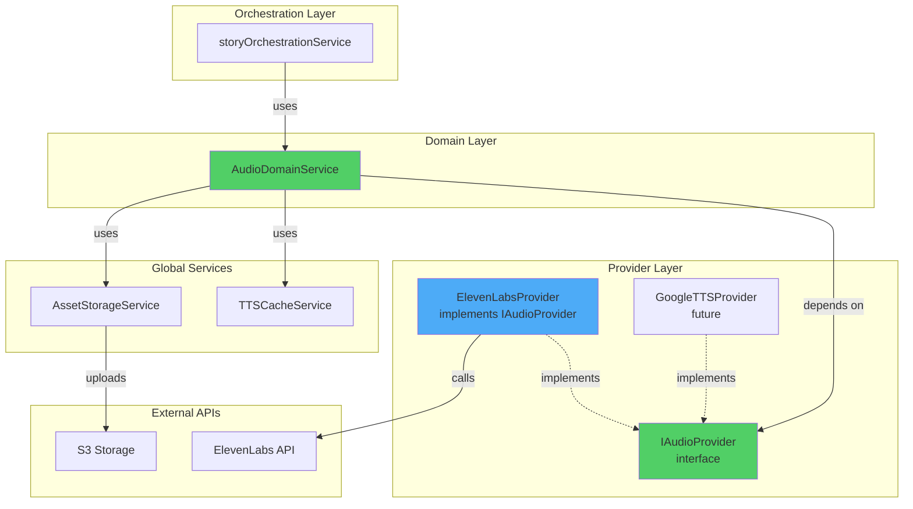
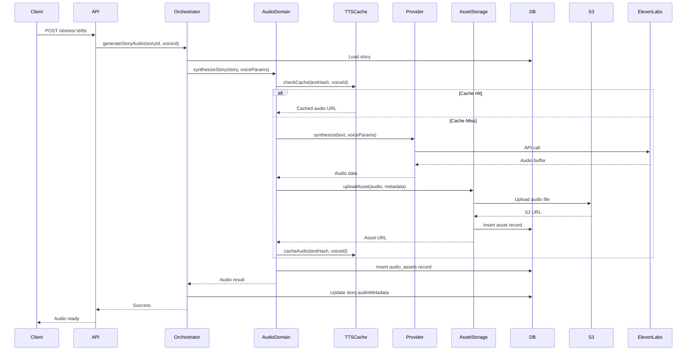
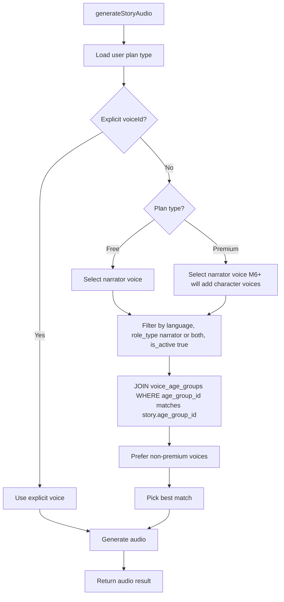
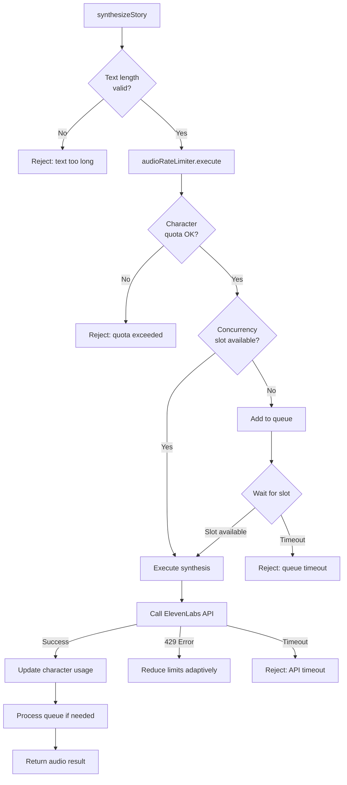

# Audio Generation Architecture (M5)

## Overview

Milestone 5 implements Text-to-Speech (TTS) audio generation for stories using a vendor-agnostic architecture. The implementation supports multiple TTS providers (ElevenLabs in MVP) with easy swapping, caching for cost optimization, and voice selection per language.

## Architecture

### Component Diagram



### Data Flow: Audio Generation



## Components

### 1. IAudioProvider Interface

**File:** `services/api/src/providers/base/IAudioProvider.ts`

Vendor-agnostic interface for TTS providers.

**Key Methods:**
- `synthesize(request)` - Synthesize text to speech
- `getVoices(language?)` - Get available voices
- `getVoice(voiceId)` - Get voice by ID
- `healthCheck()` - Test provider health

**Key Types:**
```typescript
interface SynthesizeRequest {
  text: string;
  voiceId: string;
  language: string;
  prosody?: {
    speed?: number;
    pitchShift?: number;
    nightMode?: boolean;
  };
  outputFormat?: 'mp3' | 'wav' | 'ogg';
}

interface SynthesizeResult {
  audioData: Buffer;
  mimeType: string;
  durationSeconds: number;
  format: 'mp3' | 'wav' | 'ogg';
  providerRequestId?: string;
  metadata?: {
    characterCount: number;
    model?: string;
  };
}
```

### 2. ElevenLabsProvider

**File:** `services/api/src/providers/audio/elevenlabs/ElevenLabsProvider.ts`

Implementation of `IAudioProvider` for ElevenLabs TTS.

**Features:**
- Text-to-speech synthesis with Ukrainian language support
- Voice fetching and caching (1 hour TTL)
- Prosody control (speed, stability)
- Retry logic with exponential backoff
- Error handling (rate limits, timeouts)

**Configuration:**
```typescript
constructor(
  apiKey: string,
  model: string = 'eleven_multilingual_v2'
)
```

**Voice Settings Mapping:**
- Default: `stability: 0.5`, `similarityBoost: 0.75`
- Night mode: `stability: 0.7`, `similarityBoost: 0.8`

### 3. AudioDomainService

**File:** `services/api/src/domain/audio/AudioDomainService.ts`

Business logic for audio generation.

**Responsibilities:**
- Text normalization (whitespace, unicode, language-specific)
- Voice selection and validation
- Cache management coordination
- Asset metadata creation

**Key Methods:**
```typescript
async synthesizeStory(
  story: Story,
  voiceParams: VoiceParams
): Promise<AudioResult>

async getAvailableVoices(language: string): Promise<Voice[]>

async regenerateAudio(
  storyId: string,
  newVoiceId?: string
): Promise<AudioResult>
```

### 4. TTSCacheService

**File:** `services/api/src/services/ttsCacheService.ts`

Caching service for optimizing TTS costs.

**Cache Strategy:**
- **Cache Key:** `SHA256(normalized_text + voiceId + speed)`
- **Layers:** DB metadata (permanent)
- **Hit Rate Target:** >30% after 100 stories

**Text Normalization:**
- Remove extra whitespace
- Normalize punctuation (quotes, apostrophes, ellipsis)
- Lowercase
- Language-specific normalization (Ukrainian: ʼ → ')

**Key Methods:**
```typescript
async checkCache(
  text: string,
  voiceId: string,
  speed: number
): Promise<CachedAudio | null>

generateTextHash(text: string): string

getCacheStats(): CacheStats
```

### 5. Progress Tracking

Audio generation is tracked as `STORY_TASKS.GENERATING_AUDIO` with weight `20` (20% of overall progress).

**Task Weights:**
```typescript
const TASK_WEIGHTS = {
  generating_outline: 10,
  generating_text: 20,
  validating: 5,
  generating_portraits: 5,
  generating_images: 40,
  generating_audio: 20, // M5
};
```

## Database Schema

### audio_assets Table

Stores generated audio metadata with cache keys.

```sql
CREATE TABLE audio_assets (
  id UUID PRIMARY KEY,
  story_id UUID NOT NULL REFERENCES stories(id) ON DELETE CASCADE,
  
  -- Voice info
  voice_id UUID REFERENCES tts_voices(id),
  voice_name VARCHAR(100) NOT NULL,
  language VARCHAR(10) NOT NULL,
  
  -- Prosody settings
  speed DECIMAL(3, 2) NOT NULL DEFAULT 1.0,
  pitch_shift INTEGER NOT NULL DEFAULT 0,
  night_mode BOOLEAN NOT NULL DEFAULT false,
  
  -- Content hash for caching
  text_hash VARCHAR(64) NOT NULL,
  
  -- Asset reference
  asset_id UUID NOT NULL REFERENCES assets(id),
  duration_seconds DECIMAL(8, 2),
  
  -- Provider tracking
  provider VARCHAR(50) NOT NULL DEFAULT 'elevenlabs',
  provider_request_id VARCHAR(255),
  
  -- Status
  status VARCHAR(50) NOT NULL DEFAULT 'pending',
  error_message TEXT,
  
  created_at TIMESTAMP NOT NULL DEFAULT NOW(),
  updated_at TIMESTAMP NOT NULL DEFAULT NOW()
);

-- Cache lookup index
CREATE INDEX audio_assets_cache_idx 
  ON audio_assets(text_hash, voice_id, speed);
```

### tts_voices Table

Catalog of available voices from TTS providers.

```sql
CREATE TABLE tts_voices (
  id UUID PRIMARY KEY,
  
  -- Provider identity
  provider VARCHAR(50) NOT NULL,
  provider_voice_id VARCHAR(100) NOT NULL,
  
  -- Voice metadata
  name VARCHAR(100) NOT NULL,
  language VARCHAR(10) NOT NULL,
  gender VARCHAR(20),
  age_category VARCHAR(20),
  description TEXT,
  
  -- Characteristics
  tags JSONB,
  accent VARCHAR(50),
  
  -- Configuration
  is_active BOOLEAN NOT NULL DEFAULT true,
  is_premium BOOLEAN NOT NULL DEFAULT false,
  default_speed DECIMAL(3, 2) NOT NULL DEFAULT 1.0,
  
  sample_audio_url TEXT,
  
  created_at TIMESTAMP NOT NULL DEFAULT NOW(),
  updated_at TIMESTAMP NOT NULL DEFAULT NOW(),
  
  UNIQUE(provider, provider_voice_id)
);
```

### stories.audio_metadata Column

JSONB column storing audio generation metadata:

```json
{
  "voiceId": "uuid",
  "voiceName": "Оленка",
  "totalDuration": 360.5,
  "generatedAt": "2026-01-26T12:00:00Z",
  "nightMode": false
}
```

## API Endpoints

### POST /api/v1/stories/:id/tts

Generate audio for story.

**Request:**
```json
{
  "voiceId": "optional-voice-uuid",
  "speed": 1.0,
  "nightMode": false
}
```

**Response:**
```json
{
  "status": "success",
  "message": "Audio generated successfully"
}
```

**Errors:**
- `400` - Invalid speed (must be 0.5-2.0)
- `404` - Story not found
- `500` - Generation failed

### GET /api/v1/stories/:id/audio

Get audio URL for story.

**Response:**
```json
{
  "status": "success",
  "data": {
    "audioUrl": "https://...",
    "duration": 360.5,
    "voice": {
      "id": "uuid",
      "name": "Оленка",
      "language": "uk"
    },
    "metadata": {
      "generatedAt": "2026-01-26T12:00:00Z",
      "nightMode": false,
      "cached": false
    }
  }
}
```

**Errors:**
- `404` - Story not found or audio not generated

### GET /api/v1/voices?language=uk

Get available voices.

**Query Parameters:**
- `language` (optional) - Filter by language code (uk, en, ru, es)

**Response:**
```json
{
  "status": "success",
  "data": {
    "voices": [
      {
        "id": "uuid",
        "name": "Оленка",
        "language": "uk",
        "gender": "female",
        "ageCategory": "young_adult",
        "description": "Warm storyteller voice",
        "sampleUrl": "https://...",
        "tags": ["calm", "storyteller"],
        "isPremium": false
      }
    ]
  }
}
```

## Voice Catalog System (M5+)

### Overview

Voices are managed in a curated catalog (`tts_voices` table) with automatic selection based on story and character attributes.

**Key Features:**
- **Age Groups as Reference Table**: `age_groups` with UUID primary keys
- **M2M Relationship**: `voice_age_groups` junction table
- **Role Classification**: narrator, character, or both
- **Automatic Selection**: System picks optimal voice based on metadata
- **ElevenLabs Preview**: Uses `provider_preview_url` for admin playback

**Freemium Model:**
- **Free Plan**: Single narrator voice for entire story
- **Premium Plan (current)**: Single narrator voice
- **Premium Plan (M6+)**: Multi-voice narration (narrator + character voices)

### Age Groups Table

Reference table for age groups with UUID primary keys:

```sql
CREATE TABLE age_groups (
  id UUID PRIMARY KEY,
  slug VARCHAR(10) UNIQUE NOT NULL, -- '1y', '2-3', '4-5', '6-8', '9-12'
  name_key VARCHAR(100) NOT NULL,   -- i18n key: 'age_groups.1y.name'
  min_months INTEGER NOT NULL,       -- Minimum age in months
  max_months INTEGER,                -- Maximum age (NULL for last group)
  sort_order INTEGER NOT NULL,
  is_active BOOLEAN NOT NULL DEFAULT true
);

-- Initial data
-- 1y:   12-23 months
-- 2-3:  24-47 months  
-- 4-5:  48-71 months
-- 6-8:  72-107 months
-- 9-12: 108+ months
```

**Benefits:**
- Admin UI can manage age groups (future)
- i18n support via `name_key`
- Month ranges for automatic calculation
- Type-safe UUID references

### Voice Catalog Schema

```sql
CREATE TABLE tts_voices (
  id UUID PRIMARY KEY,
  provider VARCHAR(50) NOT NULL,
  provider_voice_id VARCHAR(100) NOT NULL,
  name VARCHAR(100) NOT NULL,
  language VARCHAR(10) NOT NULL,
  gender VARCHAR(20),          -- male, female, neutral
  age_category VARCHAR(20),    -- child, young_adult, adult, senior
  
  -- NEW: Role and tags
  role_type VARCHAR(20),       -- narrator, character, both
  voice_tags VARCHAR[],        -- ['calm', 'energetic', 'wise']
  provider_preview_url TEXT,   -- ElevenLabs preview for admin playback
  
  is_active BOOLEAN NOT NULL DEFAULT true,
  is_premium BOOLEAN NOT NULL DEFAULT false,
  description TEXT,
  
  UNIQUE(provider, provider_voice_id)
);

-- Junction table for voice-age relationships
CREATE TABLE voice_age_groups (
  voice_id UUID REFERENCES tts_voices(id) ON DELETE CASCADE,
  age_group_id UUID REFERENCES age_groups(id) ON DELETE CASCADE,
  PRIMARY KEY (voice_id, age_group_id)
);
```

### Voice Selection Logic

System automatically selects voices based on:

1. **Explicit voice ID** (if provided in API request)
2. **Automatic selection** based on:
   - Story language
   - Role type (narrator/character/both)
   - Age group (via `voice_age_groups` junction)
   - Gender (for character voices)
   - Plan type (free → prefer free voices)

**Voice Selection Flow:**



**Code Example:**

```typescript
// Automatic selection in AudioDomainService
private async selectVoiceForRole(
  language: string,
  role: 'narrator' | 'character',
  characterGender?: 'male' | 'female' | 'neutral',
  ageGroupId?: string // UUID from story.age_group_id
): Promise<Voice | null> {
  // Query with filters + JOIN voice_age_groups
  const voices = await db
    .select()
    .from(ttsVoices)
    .innerJoin(voiceAgeGroups, eq(voiceAgeGroups.voiceId, ttsVoices.id))
    .where(and(
      eq(ttsVoices.language, language),
      eq(ttsVoices.isActive, true),
      or(eq(ttsVoices.roleType, role), eq(ttsVoices.roleType, 'both')),
      eq(voiceAgeGroups.ageGroupId, ageGroupId)
    ));
  
  // Prefer free voices
  const freeVoices = voices.filter(v => !v.isPremium);
  return freeVoices[0] || voices[0] || null;
}
```

### Voice Samples

- Uses ElevenLabs `provider_preview_url` for admin playback
- No custom sample generation needed (simplified approach)
- Admin UI (future) will use preview_url to listen before adding voice to catalog

### Managing Voice Catalog

**Current:** Database seeding script

```bash
npm run seed:voices
```

**Future Admin UI:**
1. Browse ElevenLabs voice library via API
2. Preview voice using `provider_preview_url`
3. Add to catalog with metadata:
   - Gender (male/female/neutral)
   - Age category (child/young_adult/adult/senior)
   - Role type (narrator/character/both)
   - Suitable age groups (checkboxes: 1y, 2-3, 4-5, 6-8, 9-12)
   - Tags (calm, energetic, wise, storyteller, etc.)
4. Activate/deactivate voices
5. View voice usage statistics

## Configuration

### Environment Variables

```bash
# Audio Provider
AUDIO_PROVIDER=elevenlabs
ELEVENLABS_API_KEY=your_api_key
ELEVENLABS_MODEL=eleven_multilingual_v2

# Audio Settings
AUDIO_MAX_RETRIES=3
AUDIO_RETRY_DELAY_MS=2000
AUDIO_MAX_TEXT_LENGTH=5000
AUDIO_CACHE_TTL=2592000

# Default Voices (optional)
DEFAULT_VOICE_UK=
DEFAULT_VOICE_EN=
DEFAULT_VOICE_RU=
DEFAULT_VOICE_ES=
```

### config.audio

```typescript
audio: {
  provider: 'elevenlabs',
  elevenlabs: {
    apiKey: string,
    model: 'eleven_multilingual_v2',
  },
  defaultVoice: {
    uk: string,
    en: string,
    ru: string,
    es: string,
  },
  maxRetries: 3,
  retryDelayMs: 2000,
  maxTextLength: 5000,
  cache: {
    ttl: 2592000, // 30 days
  },
}
```

## Cost Optimization

### Rate Limiting (M5+)

**Purpose:** Control concurrency and character usage to stay within ElevenLabs quotas.

**Architecture:**
- **Vendor-agnostic**: `AudioRateLimiter` works with any `IQuotaProvider`
- **ElevenLabsQuotaProvider**: Fetches quotas from `/v1/user/subscription` API
- **Concurrency control**: Limits simultaneous requests based on subscription tier
- **Character tracking**: Monitors monthly character usage
- **Queue management**: FIFO queue with timeouts for overflow protection

**Configuration:**
```typescript
audio: {
  maxConcurrency: 4,              // Free tier default (ElevenLabs allows 4)
  defaultCharacterLimit: 10000,   // Free tier default
  quotaRefreshIntervalMs: 300000, // Refresh every 5 minutes
  queueTimeoutMs: 300000,         // 5 min max wait in queue
  safetyMargin: 0.9,              // Use 90% of quota
  timeoutMs: 30000,               // 30s timeout per request
}
```

**ElevenLabs Quota API Response:**
```json
{
  "character_count": 5234,
  "character_limit": 10000,
  "next_character_count_reset_unix": 1738281600,
  "can_extend_character_limit": false,
  "tier": "free",
  "status": "active"
}
```

**Concurrency Limits by Tier:**
- **Free**: 4 concurrent requests
- **Starter**: 6 concurrent requests  
- **Creator**: 10 concurrent requests
- **Pro**: 20 concurrent requests
- **Scale/Business**: 30 concurrent requests
- **Enterprise**: 40+ concurrent requests (custom)

*Source: [ElevenLabs API Pricing](https://elevenlabs.io/pricing/api) - Agents section*

**Flow Diagram:**



**Error Handling:**
- **Quota exceeded**: User-friendly error with reset time
- **429 Rate limit**: Adaptive reduction of safety margin
- **Timeout**: 30s timeout with AbortController
- **Queue full**: Reject with "system overload" message

### Caching Strategy

**Cache Key:** `SHA256(normalized_text + voiceId + speed)`

**Cache Hit Scenarios:**
1. Same story, same voice, same speed → instant (100% savings)
2. Similar text, different story → potential hit
3. Regeneration request → skip if cached

**Expected Hit Rate:** >30% after 100 stories

### Text Normalization

Ensures consistent cache keys:
- Lowercase
- Normalize whitespace → single space
- Normalize unicode (apostrophes, quotes, ellipsis)
- Language-specific rules

### Estimated Costs (ElevenLabs)

**Pricing:** ~$0.015/minute (gpt-4o-mini-tts equivalent)

**Story Length Examples:**
- 500 words → ~3 minutes → $0.045
- 1000 words → ~6 minutes → $0.09
- 2000 words → ~12 minutes → $0.18

**With 30% cache hit rate:**
- 100 stories/day → ~$9/day → ~$270/month (70% generated)
- 1000 stories/day → ~$90/day → ~$2700/month (70% generated)

## Error Handling

### Retryable Errors
- Network timeouts
- Rate limit errors (429)
- Service unavailable (503)
- Temporary API errors

**Retry Strategy:** Exponential backoff (2s, 4s, 8s)

### Non-Retryable Errors
- Invalid API key (401)
- Invalid voice ID (404)
- Text too long (400)
- Unsupported language

### Graceful Degradation
- Story generates successfully without audio
- Audio can be generated later via regenerate endpoint
- User can try different voice if one fails

## Monitoring

### Metrics to Track
- Audio generation latency (p50, p95, p99)
- Cache hit rate
- Provider API errors
- Cost per generation
- Average audio duration
- Voice usage distribution

### Logs

```typescript
logger.info({ 
  storyId, 
  voiceId, 
  textLength,
  cached,
  duration 
}, 'Audio generated');

logger.warn({ 
  storyId, 
  error,
  attempt 
}, 'Audio generation retry');

logger.error({ 
  storyId, 
  error 
}, 'Audio generation failed permanently');
```

## Security

1. **API Key Protection**
   - Store in environment variables
   - Never expose in logs or responses

2. **Audio URLs**
   - Use signed URLs with expiration
   - Validate story ownership before generation

3. **Rate Limiting**
   - Per-user rate limits on audio generation
   - Respect provider rate limits

4. **Content Safety**
   - Validate text content before synthesis
   - Block prohibited content generation

## Testing

### Manual Testing

```bash
# 1. Generate audio
curl -X POST http://localhost:3000/api/v1/stories/{storyId}/tts \
  -H "Authorization: Bearer $TOKEN" \
  -H "Content-Type: application/json" \
  -d '{"nightMode": true}'

# 2. Get audio URL
curl http://localhost:3000/api/v1/stories/{storyId}/audio \
  -H "Authorization: Bearer $TOKEN"

# 3. List voices
curl http://localhost:3000/api/v1/voices?language=uk \
  -H "Authorization: Bearer $TOKEN"

# 4. Regenerate with different voice
curl -X POST http://localhost:3000/api/v1/stories/{storyId}/tts \
  -H "Authorization: Bearer $TOKEN" \
  -H "Content-Type: application/json" \
  -d '{"voiceId": "different_voice_id"}'
```

### Unit Tests (TODO)

1. **ElevenLabsProvider:**
   - Voice fetching
   - Synthesis with different parameters
   - Error handling
   - Retry logic

2. **AudioDomainService:**
   - Text normalization
   - Cache integration
   - Business logic

3. **TTSCacheService:**
   - Cache hit/miss
   - Key generation
   - Invalidation

### Integration Tests (TODO)

1. Full flow: Story → Audio generation → Asset storage
2. Cache behavior verification
3. Progress tracking updates
4. API endpoint responses

## Future Enhancements

### M9: Premium Audio Features
- Multiple voice actors for different characters
- Background music
- Sound effects
- Advanced prosody (SSML)

### M10: Advanced Features
- Real-time streaming TTS
- Voice cloning (parent's voice)
- Audio effects (reverb, echo)
- Multi-language mixing

## Troubleshooting

### Audio not generating

1. Check ElevenLabs API key
2. Check voice ID validity
3. Check text length (< 5000 chars)
4. Check rate limits

### Cache not working

1. Verify text normalization
2. Check cache key generation
3. Verify DB indexes

### Low cache hit rate

1. Ensure text normalization is consistent
2. Check if stories use diverse voices
3. Verify speed variations

## References

- [ElevenLabs API Documentation](https://elevenlabs.io/docs/api-reference)
- [ElevenLabs Pricing](https://elevenlabs.io/pricing)
- [Ukrainian TTS Voices](https://elevenlabs.io/voice-library?language=ukrainian)
- Concept Document: Section 14.6 "Озвучка разными голосами"
- Concept Document: Section 9 "Озвучка и режим сна"
