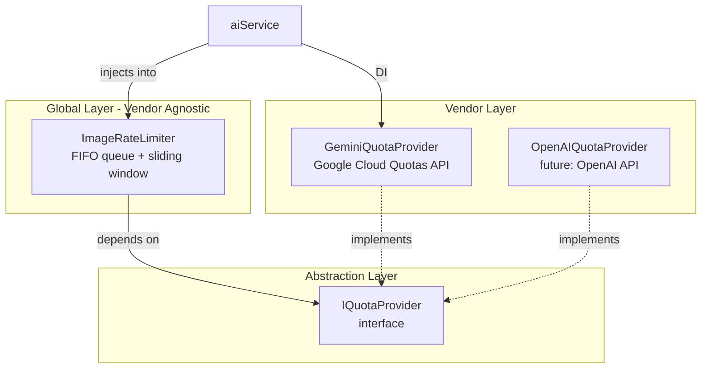

# Image Generation Rate Limiter

## Overview

Vendor-agnostic rate limiting system for image generation APIs that controls requests per minute (RPM) using a sliding window algorithm. Supports multiple cloud providers (Google Cloud, AWS, OpenAI, etc.) through abstraction interfaces.

## Architecture

### Vendor Abstraction



**Key Design Principles:**
- **ImageRateLimiter** is vendor-agnostic and reusable
- **IQuotaProvider** abstracts quota fetching from any vendor
- **GeminiQuotaProvider** contains Google-specific logic
- **Dependency Injection** in aiService.ts manages vendor selection

### Components

1. **ImageRateLimiter** (`services/imageRateLimiter.ts`) - **Vendor-agnostic**
   - Sliding window counter for RPM tracking
   - FIFO queue for overflow requests
   - Works with any IQuotaProvider implementation
   - Automatic cleanup of old timestamps
   - Adaptive safety margin adjustment

2. **IQuotaProvider** (`providers/base/IQuotaProvider.ts`) - **Interface**
   - Abstract interface for quota management
   - Implemented by vendor-specific providers
   - Methods: `getRPMLimit()`, `reduceRPMLimit()`, `getCachedLimit()`

3. **GeminiQuotaProvider** (`providers/image/gemini/GeminiQuotaProvider.ts`) - **Vendor-specific**
   - Fetches dynamic RPM limits from Google Cloud Quotas API
   - Caches limits for 5 minutes
   - Fallback to default (150 RPM) if API unavailable
   
4. **NanoBananaProProvider** (`providers/image/nanobananapro/NanoBananaProProvider.ts`) (main scene pipeline)
   - Wraps API calls with rate limiter via `ImageDomainService` / orchestration
   - Retry logic lives in the provider
   - Detects 429 errors for adaptive adjustment where applicable

## Configuration

Environment variables in `.env`:

```bash
# RPM Rate Limiting
IMAGE_RPM_DEFAULT_LIMIT=150              # Default RPM (Tier 1)
IMAGE_RPM_SAFETY_MARGIN=0.9              # Use 90% of quota
IMAGE_RPM_QUOTA_REFRESH_INTERVAL_MS=300000  # 5 minutes
IMAGE_QUEUE_TIMEOUT_MS=300000            # 5 minutes max wait

# Google Cloud (for Quotas API)
GOOGLE_CLOUD_PROJECT=your-project-id
GOOGLE_CLOUD_CREDENTIALS=/path/to/service-account.json
GOOGLE_CLOUD_LOCATION=us-central1
```

## How It Works

### Sliding Window Algorithm

1. **Tracks timestamps** of all requests in last 60 seconds
2. **Cleans up old timestamps** (>60s) automatically
3. **Checks available slots**: `effectiveLimit = maxRPM * safetyMargin`
4. **Executes immediately** if slots available
5. **Queues task** if limit reached, processes when window clears

### Example Scenario (RPM = 150)

```
Time 0s: 150 requests start immediately (burst)
Time 24s: First requests exit 60s window → new slots available
Time 40s: Steady state at ~2.5 requests/second
Time 160s: All 400 tasks completed (~2.67 minutes total)
```

### Rate Calculation

- **RPM 150** → 2.5 requests/second sustained
- **Safety margin 90%** → effective limit 135 RPM
- **400 tasks** ÷ 150 RPM ≈ 2.67 minutes theoretical minimum

## API Endpoints

### Health Check with Rate Limiter Stats

```bash
GET /health/image-rate-limiter
```

**Response:**
```json
{
  "status": "healthy",
  "timestamp": "2026-01-26T12:00:00Z",
  "rateLimiter": {
    "currentRPM": 45,
    "maxRPM": 150,
    "effectiveLimit": 135,
    "requestsLast60s": 45,
    "queuedTasks": 0,
    "processedTotal": 1234,
    "utilizationPercent": 30
  },
  "quotaProvider": {
    "cachedLimit": 150,
    "currentConfiguredLimit": 150
  }
}
```

**Status levels:**
- `healthy`: utilization < 75%
- `warning`: utilization 75-90%
- `critical`: utilization > 90%

## Error Handling

### 429 Rate Limit Exceeded

When Google returns 429 error:
1. **Reduce safety margin** by 10% (min 70%)
2. **Update quota service** with reduced limit
3. **Log warning** with old/new limits
4. **Continue processing** with new limit

### Queue Timeout

If task waits > 5 minutes:
- **Reject task** with timeout error
- **Continue other tasks** (graceful degradation)
- **Story generation proceeds** without this image

### Cloud Quotas API Unavailable

If quota fetch fails:
- **Use cached limit** if available
- **Fallback to default** (150 RPM)
- **Retry in 5 minutes**
- **Log warning**

## Monitoring

### Logs

```
[INFO] ImageRateLimiter initialized { defaultRPM: 150, safetyMargin: 0.9 }
[DEBUG] Executing image generation immediately { rpm: 45/150, queued: 0 }
[INFO] Image generation queued { queuePosition: 23, currentRPM: 135/150 }
[WARN] Received 429 error, reducing RPM limit { oldLimit: 150, newLimit: 135 }
[DEBUG] Cleaned up old timestamps { cleaned: 15, remaining: 120 }
```

### Metrics

Available via `/health/image-rate-limiter`:
- **currentRPM**: Requests in last 60 seconds
- **queuedTasks**: Number of tasks waiting
- **processedTotal**: Total tasks processed since startup
- **utilizationPercent**: Current usage of quota

## Testing

Run rate limiter tests:

```bash
# Manual test with 400 tasks
npx ts-node src/services/__tests__/imageRateLimiter.test.ts
```

**Test verifies:**
- ✅ No RPM violations (never exceeds 150 in any 60s window)
- ✅ All 400 tasks complete successfully
- ✅ Duration matches theoretical minimum (~160 seconds)
- ✅ Sliding window cleanup works correctly

## Usage in Code

Rate limiting is **transparent** to orchestration code:

```typescript
// In storyOrchestrationService.ts (conceptual — actual flow uses concurrency pool + generateSceneImageWithReference)
// Rate limiting happens inside the image domain / provider.
```

**Behind the scenes:**
1. `generateSceneImageWithReference()` → `ImageDomainService`
2. → `NanoBananaProProvider` (or configured `IImageProvider`)
3. → **`rateLimiter.execute()`** ← Rate limiting happens here
4. → Gemini image API (`generateContent`)

## Troubleshooting

### High queue sizes

**Symptoms:** `/health/image-rate-limiter` shows `queuedTasks > 100`

**Causes:**
- Too many concurrent story generations
- RPM limit too low for traffic

**Solutions:**
- Increase `IMAGE_RPM_DEFAULT_LIMIT` if your plan supports it
- Add user-level rate limiting at API endpoints
- Monitor `/health/image-rate-limiter` and alert on high utilization

### Frequent 429 errors

**Symptoms:** Logs show repeated "Received 429 error" warnings

**Causes:**
- Safety margin too high
- Google quota lower than configured
- Clock drift between servers

**Solutions:**
- Reduce `IMAGE_RPM_SAFETY_MARGIN` to 0.8 (80%)
- Verify actual quota in Google Cloud Console
- Check Cloud Quotas API is working: `GET /health/detailed`

### Slow image generation

**Symptoms:** Stories take > 5 minutes with few images

**Causes:**
- Queue timeout too short
- RPM limit too conservative

**Solutions:**
- Increase `IMAGE_QUEUE_TIMEOUT_MS` to 600000 (10 min)
- Increase `IMAGE_RPM_SAFETY_MARGIN` to 0.95 (95%)
- Check actual quota usage vs configured limit

## Future Improvements

1. **Priority Queue**: Premium users get priority
2. **Redis Integration**: Share rate limit across multiple instances
3. **TPM Control**: Track tokens per minute if Google charges by tokens
4. **Circuit Breaker**: Stop requests temporarily after repeated failures
5. **Prometheus Metrics**: Export RPM gauge for Grafana dashboards
6. **Adaptive Learning**: ML-based quota prediction

## References

- [Gemini API Rate Limits](https://ai.google.dev/gemini-api/docs/rate-limits)
- [Cloud Quotas API](https://cloud.google.com/docs/quotas/api-overview)
- [Vertex AI Quotas](https://cloud.google.com/vertex-ai/generative-ai/docs/quotas)
